# 3C 电子商城平台（前后端分离）

## 1. 项目简介
本项目是 3C 电子商城平台，采用前后端分离架构，覆盖前台浏览、购物车、下单、支付、订单跟踪，以及后台 RBAC、商品/订单/用户管理、统计导出等功能。

## 2. 技术栈
- 后端：Spring Boot 3.x + Spring MVC + Spring Security + MyBatis-Plus + MySQL + Redis
- 前端：Vue 3 + Vue Router + Pinia + Axios + Element Plus + TailwindCSS
- 其他：Apache POI（Excel 导出）、Jsoup（富文本 XSS 清洗）、Postman/Newman（接口与 E2E 测试）、Docker Compose、Nginx（TLS 终止）

## 3. 架构与模块
- 表现层：Vue（商城前台 + 管理后台）
- 控制层：Controller（REST API）
- 业务层：Service / ServiceImpl
- 持久层：Mapper/Repository（MyBatis-Plus）
- 数据层：MySQL + Redis

模块划分：
- auth：登录/注册/JWT
- product：商品/分类/轮播/搜索/详情/多图
- cart：购物车
- order：下单/支付/订单流转
- admin：用户/菜单/RBAC/商品/订单/统计/导出
- common：统一返回体/异常/工具/审计

## 4. 功能实现清单
- 前台：
  - 首页轮播图 + 推荐/热销/促销
  - 商品搜索分页、商品详情（多图/规格/库存）
  - 购物车（增删改查、勾选、总价）
  - 地址管理（CRUD）
  - 下单事务、模拟支付、订单列表/状态筛选/确认收货
- 后台：
  - 用户管理、菜单管理、角色管理（RBAC）
  - 商品管理、分类管理、轮播图管理
  - 订单管理、发货（物流单号可选）
  - 统计报表与 Excel 导出
- 安全与性能：
  - BCrypt 密码加密
  - JWT 鉴权、401/403 拦截
  - 上传白名单、XSS 清洗
  - Redis 缓存（首页/详情/搜索）
  - 登录失败次数限制
- 运维与测试：
  - Docker Compose 一键启动
  - Postman 权限验收与 E2E 验证脚本

## 5. 项目流程
- 前台闭环：浏览商品 -> 加入购物车 -> 确认订单 -> 支付 -> 订单跟踪
- 后台闭环：商品管理 -> 订单管理/发货 -> 统计与导出

## 6. 数据库表设计（核心字段）
- user：id, username, phone, password_hash, status, role_id, created_at
- role：id, role_key, role_name
- menu：id, parent_id, name, path, component, type, perm_code, sort, visible
- role_menu：role_id, menu_id
- category：id, name, parent_id, sort, status
- product：id, category_id, name, brief, price, stock, status, cover_url, detail_html, created_at
- product_image：id, product_id, url, sort
- banner：id, image_url, link_type, link_target, sort, status
- cart_item：id, user_id, product_id, quantity, checked, created_at
- address：id, user_id, receiver, phone, province, city, area, detail, is_default
- order：id, order_no, user_id, total_amount, pay_amount, status, address_snapshot, created_at, paid_at, shipped_at, finished_at
- order_item：id, order_id, product_id, product_name_snapshot, price_snapshot, quantity, image_snapshot
- order_delivery：order_id, express_no, express_company
- operation_log：id, admin_id, action, target, detail, created_at
- merchant_notice：id, notice_type, order_no, content, status, created_at

> 建表 SQL 参考：`backend-mall/src/main/resources/sql/basic.sql`

## 7. 接口清单与时序图

### 7.1 Auth
#### 7.1.1 注册
- `POST /api/auth/register`
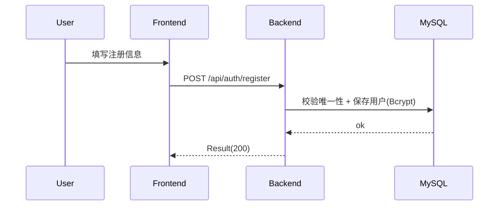

#### 7.1.2 登录
- `POST /api/auth/login`
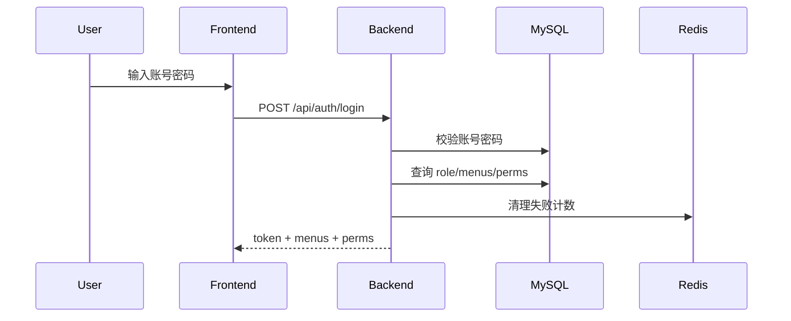

#### 7.1.3 退出
- `POST /api/auth/logout`
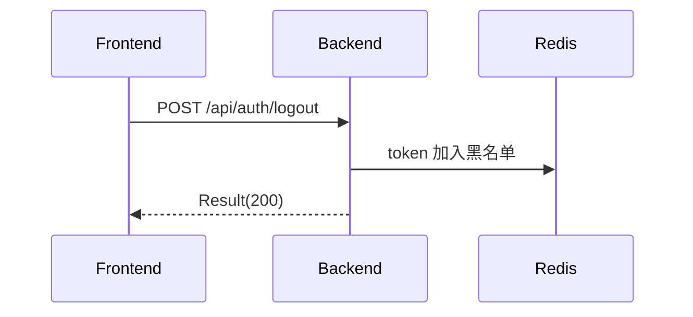

#### 7.1.4 当前登录信息
- `GET /api/auth/me`
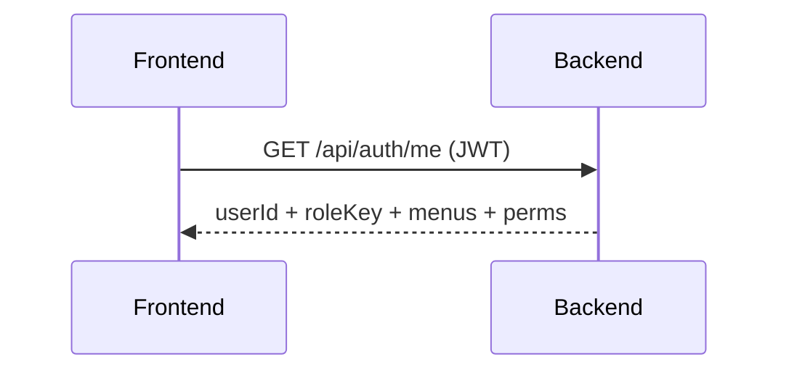

### 7.2 Home
#### 7.2.1 轮播图
- `GET /api/home/banners`
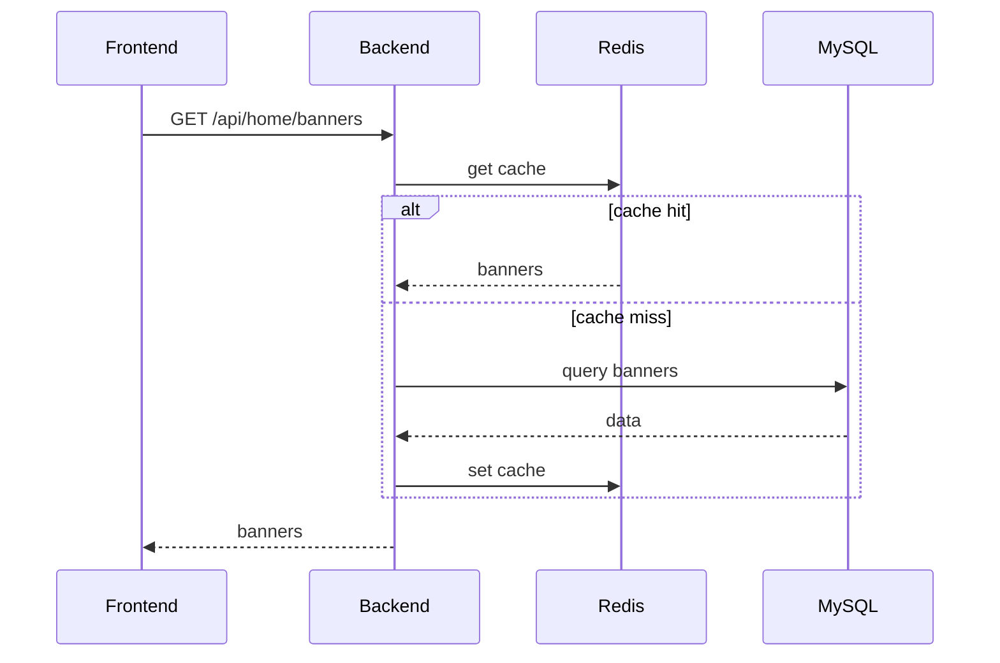

#### 7.2.2 推荐/热销/促销
- `GET /api/home/recommend`
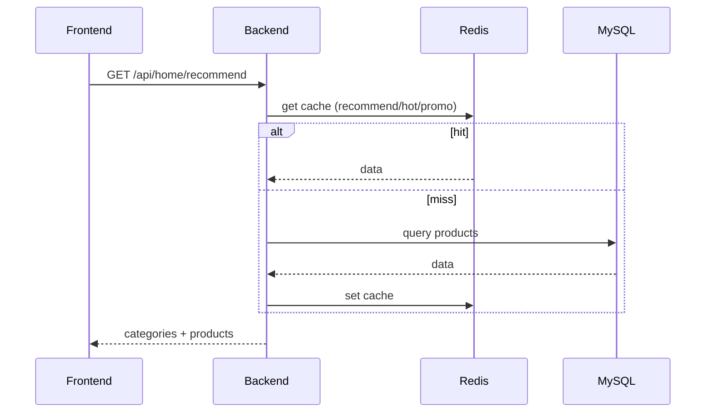

### 7.3 Product
#### 7.3.1 搜索分页
- `GET /api/products`
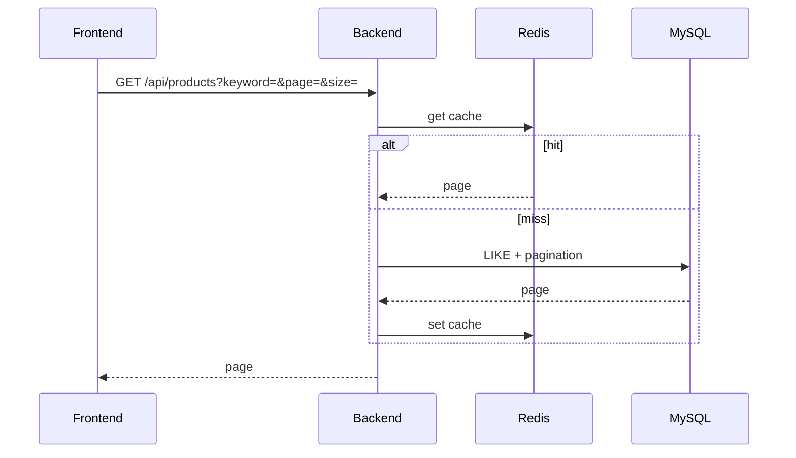

#### 7.3.2 详情（多图/规格）
- `GET /api/products/{id}`
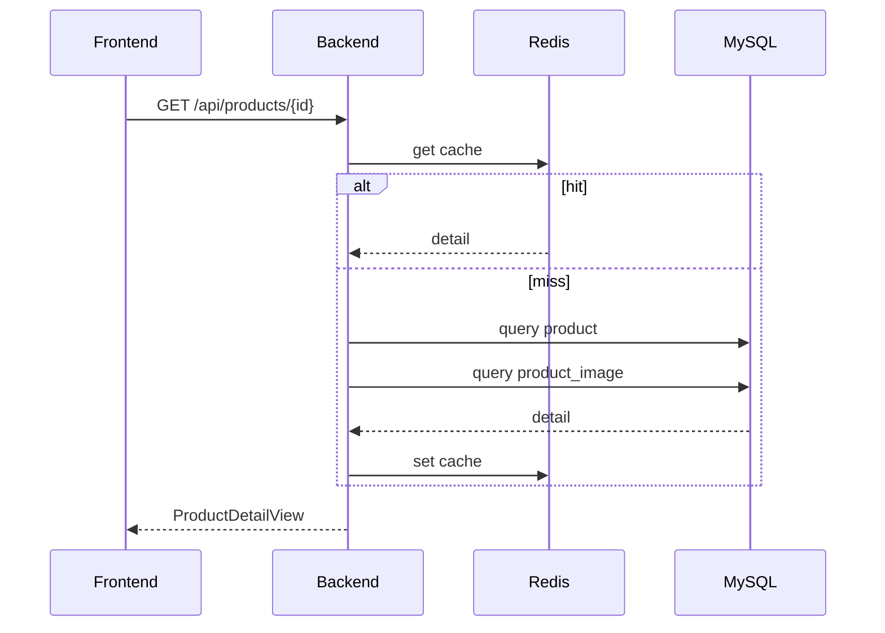

### 7.4 Cart
#### 7.4.1 加入购物车
- `POST /api/cart/items`
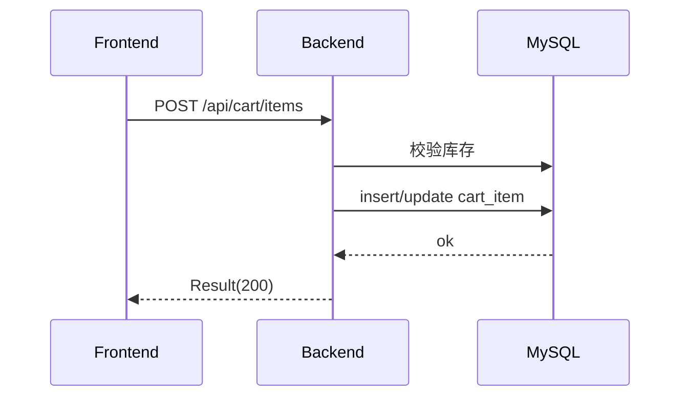

#### 7.4.2 查询购物车
- `GET /api/cart/items`
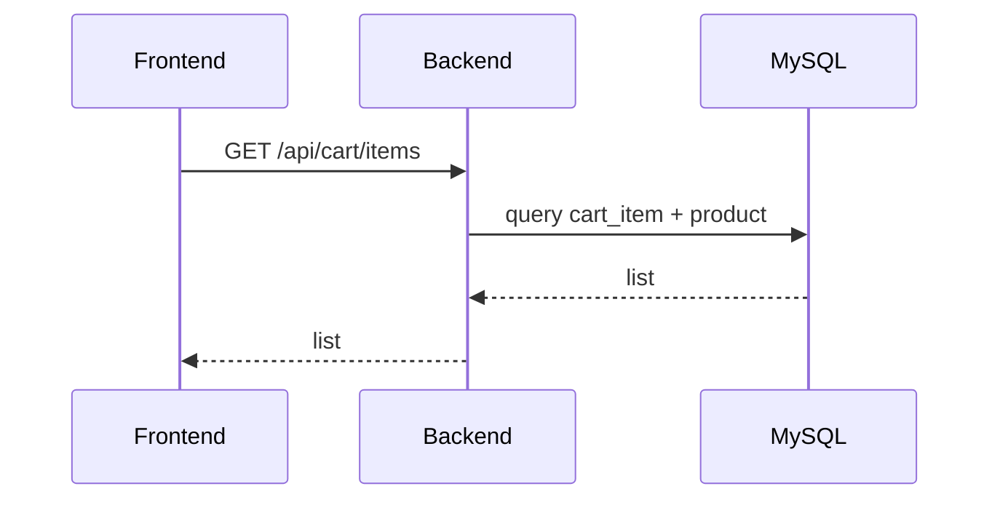

#### 7.4.3 更新购物车
- `PUT /api/cart/items/{id}`
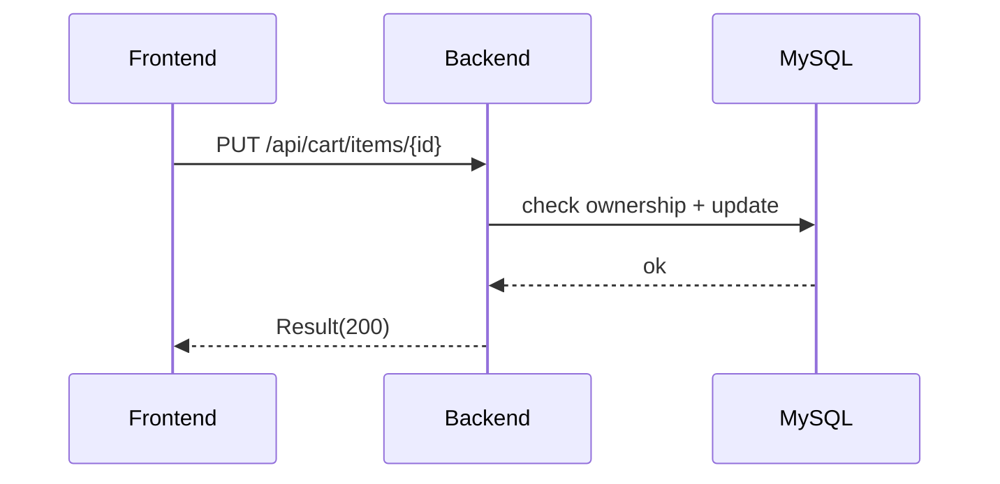

#### 7.4.4 删除购物车项
- `DELETE /api/cart/items/{id}`
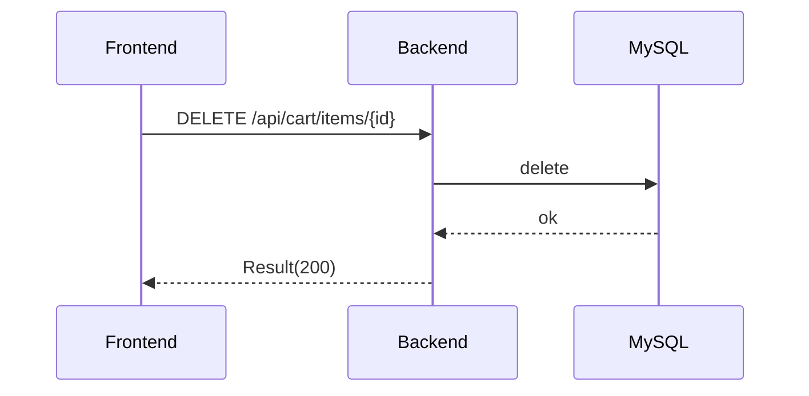

### 7.5 Address
#### 7.5.1 地址列表
- `GET /api/addresses`
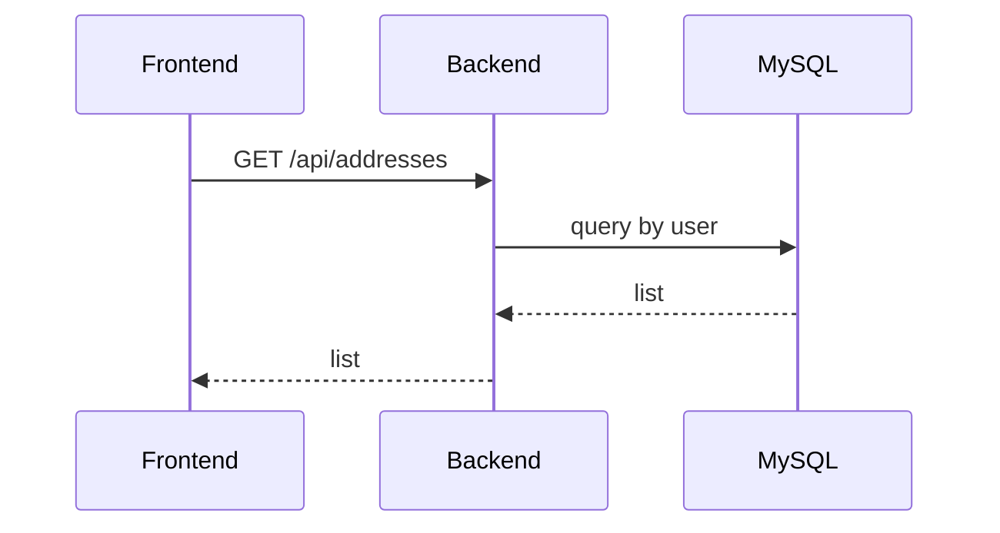

#### 7.5.2 新增地址
- `POST /api/addresses`
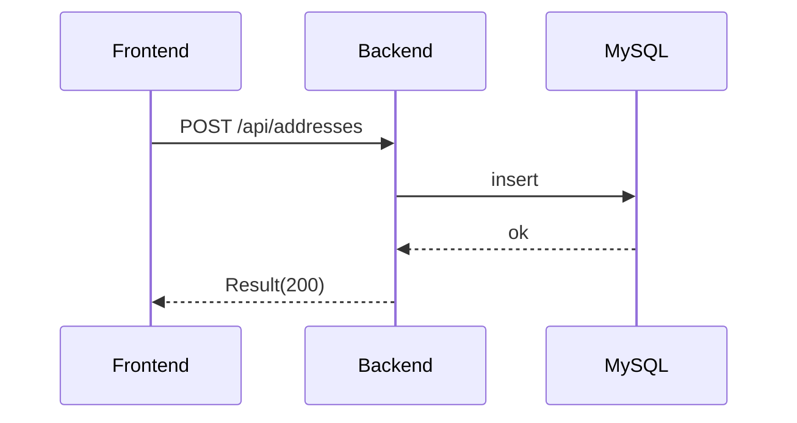

#### 7.5.3 更新地址
- `PUT /api/addresses/{id}`
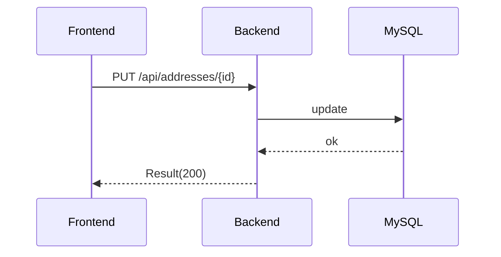

#### 7.5.4 删除地址
- `DELETE /api/addresses/{id}`


### 7.6 Order
#### 7.6.1 确认页
- `GET /api/orders/pre`
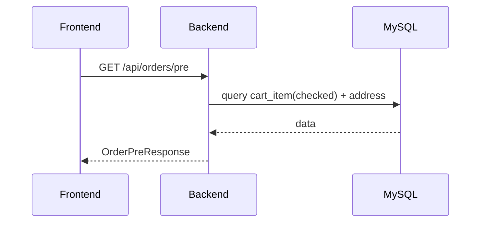

#### 7.6.2 创建订单事务
- `POST /api/orders`
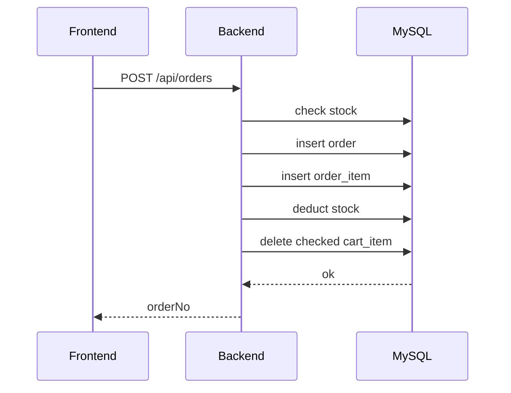

#### 7.6.3 支付
- `POST /api/orders/{orderNo}/pay`
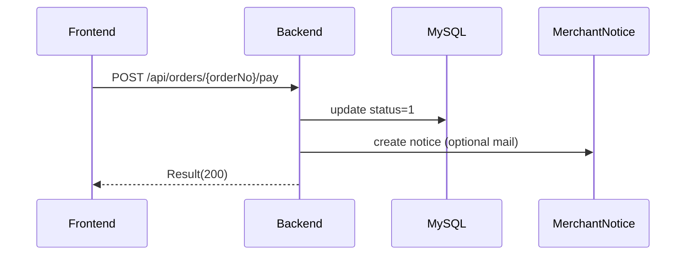

#### 7.6.4 订单列表
- `GET /api/orders`
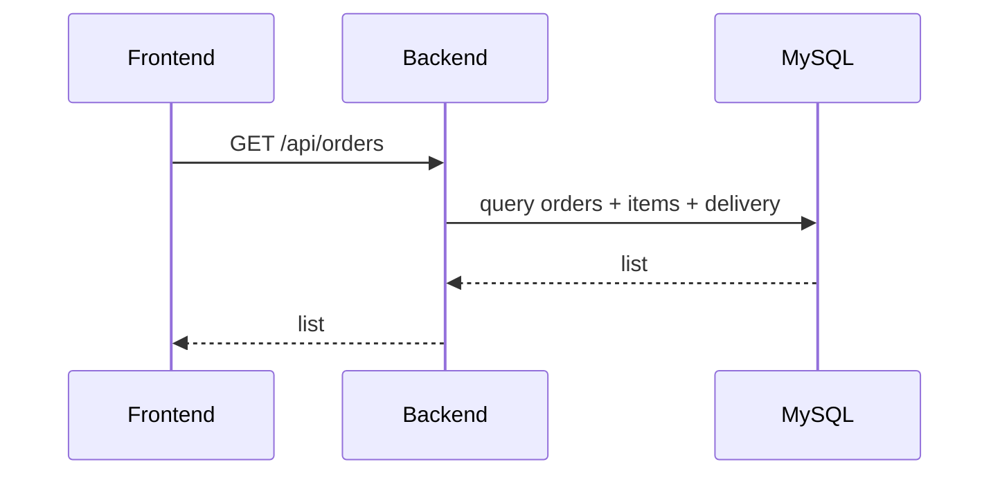

#### 7.6.5 确认收货
- `POST /api/orders/{orderNo}/confirm`
```mermaid
sequenceDiagram
  participant FE as Frontend
  participant BE as Backend
  participant DB as MySQL
  FE->>BE: POST /api/orders/{orderNo}/confirm
  BE->>DB: update status=3
  DB-->>BE: ok
  BE-->>FE: Result(200)
```

### 7.7 Admin
#### 7.7.1 用户管理
- `GET /api/admin/users`
- `POST /api/admin/users`
- `PUT /api/admin/users/{id}`
- `PUT /api/admin/users/{id}/disable`
- `PUT /api/admin/users/{id}/reset-password`
```mermaid
sequenceDiagram
  participant A as Admin FE
  participant BE as Backend
  participant DB as MySQL
  A->>BE: admin users CRUD
  BE->>DB: query/update/insert
  DB-->>BE: ok
  BE-->>A: Result(200)
```

#### 7.7.2 菜单/角色管理
- `GET /api/admin/menus/tree`
- `POST/PUT/DELETE /api/admin/menus`
- `GET /api/admin/roles`
- `POST/PUT/DELETE /api/admin/roles`
- `PUT /api/admin/roles/{id}/menus`
```mermaid
sequenceDiagram
  participant A as Admin FE
  participant BE as Backend
  participant DB as MySQL
  A->>BE: admin menu/role
  BE->>DB: update menu/role/role_menu
  DB-->>BE: ok
  BE-->>A: Result(200)
```

#### 7.7.3 商品/分类/轮播图
- `GET /api/admin/products`
- `POST/PUT/DELETE /api/admin/products`
- `GET /api/admin/categories`
- `POST/PUT/DELETE /api/admin/categories`
- `GET /api/admin/banners`
- `POST/PUT/DELETE /api/admin/banners`
```mermaid
sequenceDiagram
  participant A as Admin FE
  participant BE as Backend
  participant DB as MySQL
  A->>BE: admin product/category/banner
  BE->>DB: insert/update/delete
  DB-->>BE: ok
  BE-->>A: Result(200)
```

#### 7.7.4 上传
- `POST /api/admin/upload`
```mermaid
sequenceDiagram
  participant A as Admin FE
  participant BE as Backend
  participant FS as FileSystem
  A->>BE: upload file
  BE->>FS: save file
  FS-->>BE: url
  BE-->>A: Result(200, url)
```

#### 7.7.5 订单管理
- `GET /api/admin/orders`
- `POST /api/admin/orders/{orderNo}/ship`
- `GET /api/admin/orders/export`
```mermaid
sequenceDiagram
  participant A as Admin FE
  participant BE as Backend
  participant DB as MySQL
  A->>BE: query/ship/export
  BE->>DB: update order + delivery
  DB-->>BE: ok
  BE-->>A: Result(200)/file
```

#### 7.7.6 统计
- `GET /api/admin/stats/overview`
```mermaid
sequenceDiagram
  participant A as Admin FE
  participant BE as Backend
  participant DB as MySQL
  A->>BE: stats overview
  BE->>DB: aggregate query
  DB-->>BE: stats
  BE-->>A: Result(200)
```

#### 7.7.7 商家通知
- `GET /api/admin/notices`
- `PUT /api/admin/notices/{id}/read`
```mermaid
sequenceDiagram
  participant A as Admin FE
  participant BE as Backend
  participant DB as MySQL
  A->>BE: list/read notice
  BE->>DB: query/update
  DB-->>BE: ok
  BE-->>A: Result(200)
```

## 8. 运行方式
- 后端：`backend-mall` 使用 `mvn spring-boot:run`
- 前端：`frontend-mall/frontend-mall` 使用 `npm run dev`
- Swagger：`/swagger-ui/index.html`
- Docker：`docker compose up -d --build`

> 注意：若无法访问 Maven Central，需要配置 Maven 镜像，否则 Swagger 依赖无法下载。
*** End Patch
