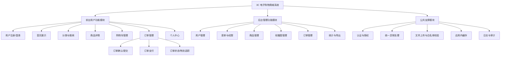
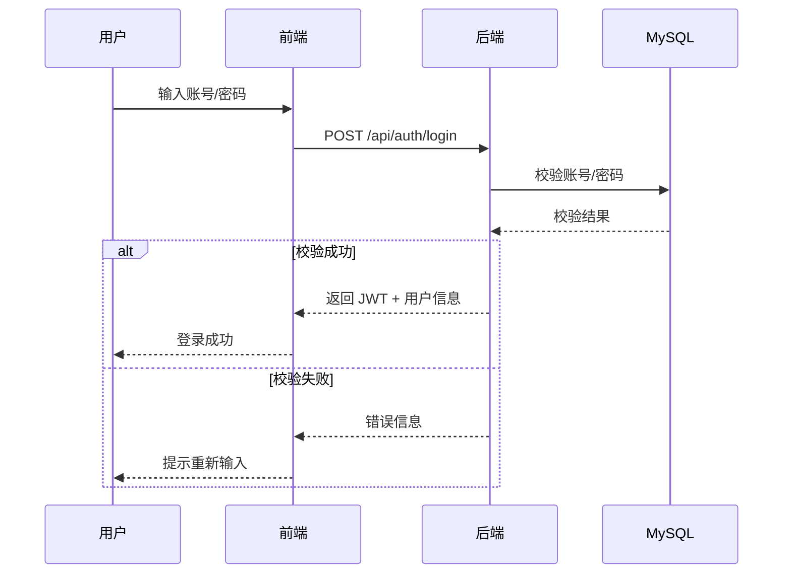
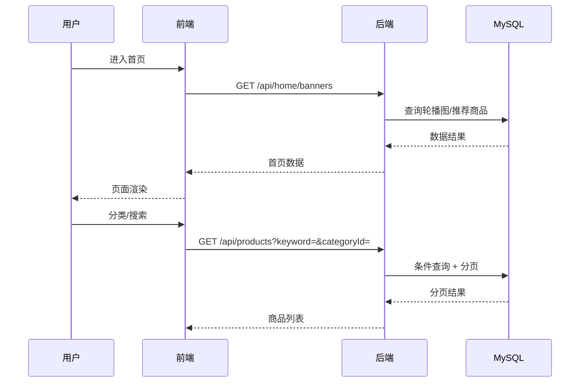
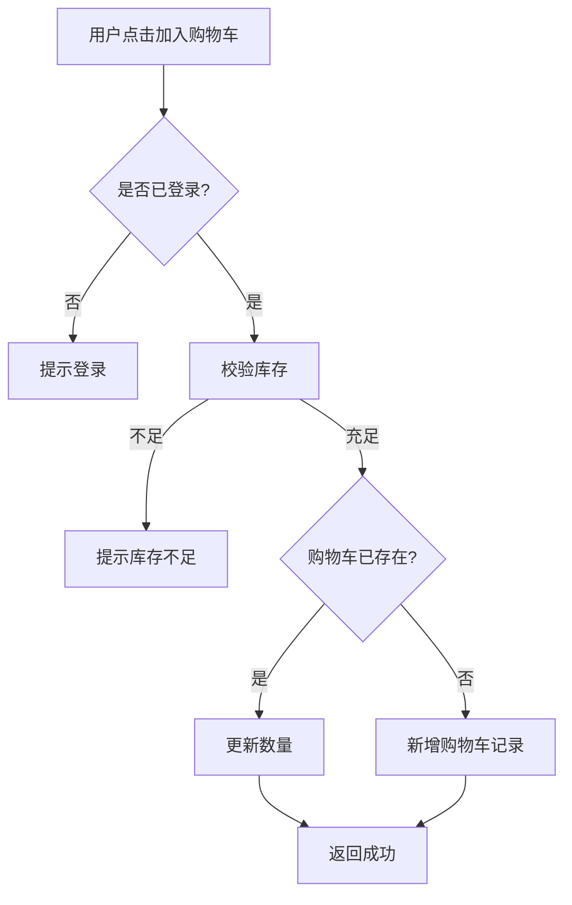
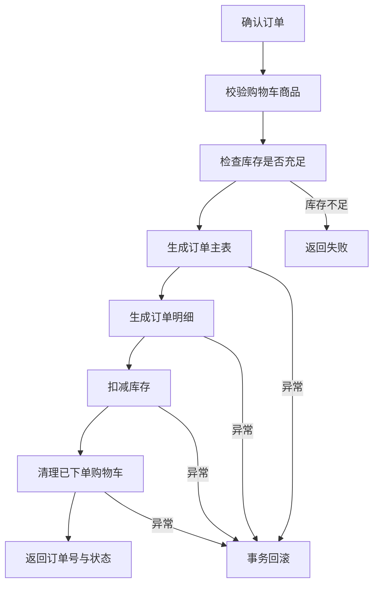
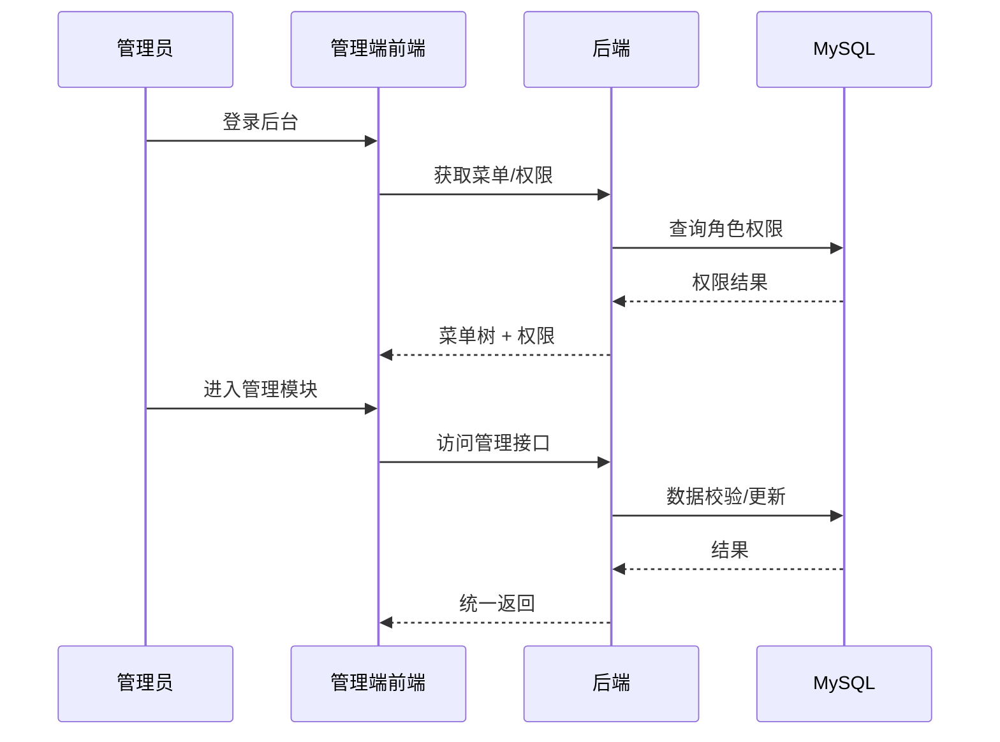

# 4 架构概述与功能结构设计（改写）

本系统为“3C 电子购物商城”，采用前后端分离模式：
- 前端：Vue 3 构建用户端与管理端界面，负责交互与状态呈现。
- 后端：Spring Boot 提供 REST API，负责业务规则、权限与数据持久化。
- 数据层：MySQL 作为唯一持久化数据库；系统级缓存使用应用内缓存（非 Redis）。

整体架构围绕“商品浏览—下单—支付—履约”的交易链路设计，并以后台管理的“内容维护—订单处理—统计分析”为支撑闭环。

## 4.3 系统的功能结构设计

根据需求分析结果，系统功能划分为前台用户功能模块、后台管理功能模块以及公共支撑模块三部分。系统功能结构如图 4.2 所示。



图 4.2 系统功能结构设计图

### 4.3.1 前台用户功能结构设计

前台功能面向普通消费者，围绕“浏览—下单—支付—跟踪”的核心路径设计：

（1）用户注册与登录功能：完成注册、登录、退出与身份校验，为个性化操作提供身份基础。  
（2）首页展示功能：展示轮播图、推荐商品与分类导航，快速引导用户进入商品浏览。  
（3）商品分类与搜索功能：支持分类筛选与关键词搜索，提升商品检索效率。  
（4）商品详情功能：展示价格、库存、参数、图片与详细描述，辅助购买决策。  
（5）购物车管理功能：支持加入、数量修改、删除与勾选结算，集中管理待购商品。  
（6）订单管理功能：支持订单确认、提交、支付、查询、确认收货与物流轨迹查看。  
（7）个人中心功能：管理个人信息、收货地址与历史订单，提供用户自助管理能力。  

### 4.3.2 后台管理功能结构设计

后台功能面向管理员，侧重平台运营与资源维护：

（1）用户管理功能：查看用户信息、禁用异常账号、重置密码等。  
（2）菜单权限管理功能：维护菜单与权限节点，基于角色分配访问范围。  
（3）商品管理功能：商品新增/编辑/删除、上下架、图片上传与分类维护。  
（4）轮播图管理功能：轮播图新增/编辑/删除与排序控制。  
（5）订单管理功能：订单列表、详情查看、发货处理与状态更新。  
（6）统计导出功能：订单与销售数据统计分析，并支持导出。  

### 4.3.3 公共支撑模块设计

公共支撑模块用于保障系统稳定与安全运行：

（1）认证与权限模块：基于 JWT 与 Spring Security，实现身份认证与权限校验。  
（2）统一异常处理模块：集中处理业务异常与系统异常，统一返回规范。  
（3）文件上传模块：支持图片上传，并通过白名单校验限制文件类型。  
（4）应用内缓存模块：对首页与热点数据进行轻量缓存，提升响应效率（无 Redis 依赖）。  
（5）日志与审计模块：记录关键操作与异常信息，便于问题追踪。  

## 4.4 系统控制流程

系统控制流程描述各模块在典型业务场景中的调用关系与执行顺序。本文重点给出登录、商品浏览、购物车与订单处理流程。

### 4.4.1 用户登录控制流程

用户在登录页输入账号密码，前端发送登录请求，后端校验成功后签发 JWT，前端保存并在后续请求中携带。该流程确保敏感资源访问必须经过认证。



图 4.3 用户登录控制流程图

### 4.4.2 商品浏览控制流程

用户进入首页后，前端请求轮播图与推荐商品；后端查询数据库或应用内缓存并返回。用户进行分类或关键词检索时，后端按分页返回结果。



图 4.4 商品浏览控制流程图

### 4.4.3 购物车控制流程

用户点击“加入购物车”时，系统验证登录状态并检查库存；若购物车已存在该商品则更新数量，否则新增记录。购物车页面支持数量修改、删除与勾选结算。



### 4.4.4 订单处理控制流程

订单处理流程为系统核心交易流程，包含库存校验、订单与明细生成、扣减库存、清理购物车等步骤，失败需回滚以保证一致性。



订单金额计算公式：

```
TotalAmount = Σ(Price_i × Quantity_i), i = 1..n
```

其中 Price_i 为第 i 个商品单价，Quantity_i 为购买数量，n 为订单商品项数量。

图 4.5 订单处理控制流程图

### 4.4.5 后台管理控制流程

管理员登录后台后，系统根据角色加载可访问菜单与操作权限。进入各管理模块时，前端进行菜单权限控制，后端执行接口级权限校验并记录关键操作。


