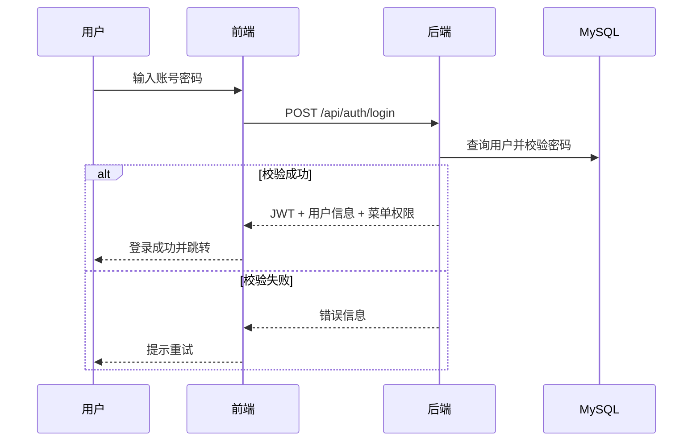
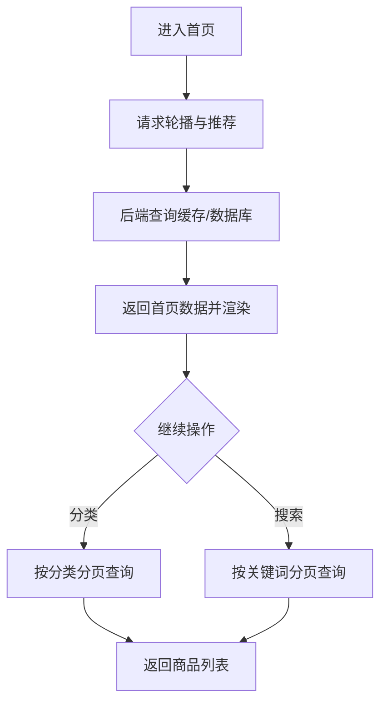
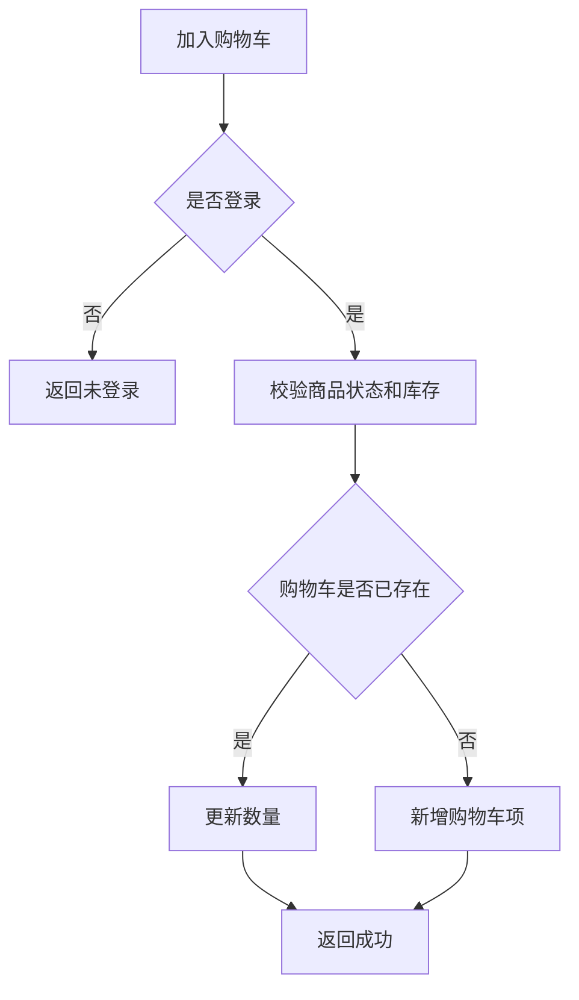
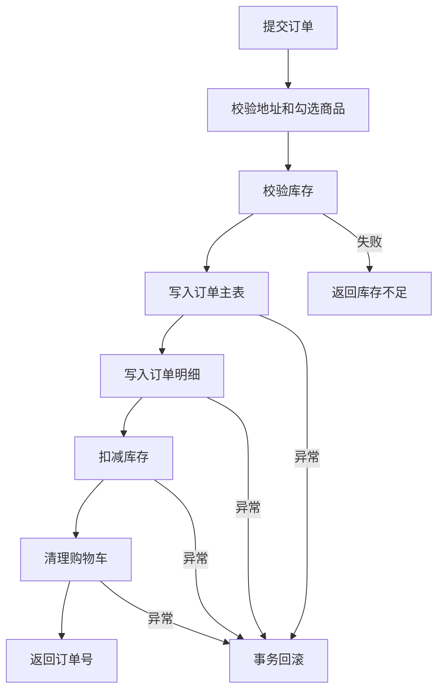
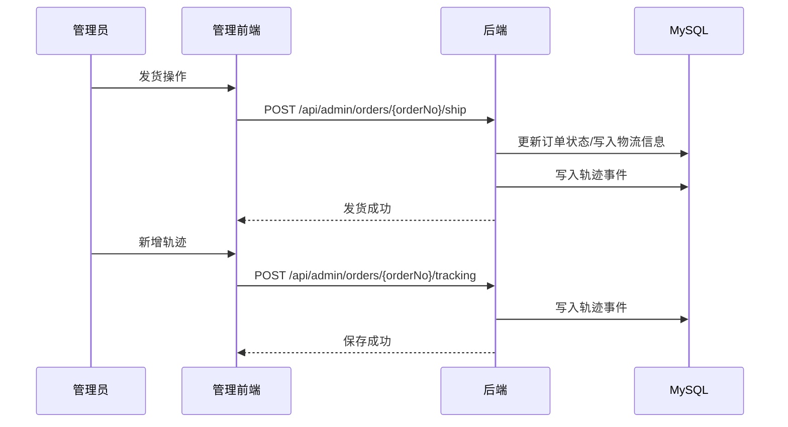

# 第5章 系统实现（分步骤）

本章基于项目源码编写，覆盖环境配置、主要界面、核心流程图与代码设计，并给出核心功能代码的完整定位与关键实现。

## 步骤1：核心功能与源码映射

### 5.1.1 前台用户核心功能

| 功能 | 前端页面 | 前端 API | 后端 Controller | 后端 Service | 核心数据表 |
|---|---|---|---|---|---|
| 注册/登录/退出 | `Login.vue` `Register.vue` | `src/api/auth.js` | `AuthController` | `AuthServiceImpl` | `user` `role` `menu` `role_menu` |
| 首页轮播与推荐 | `Home.vue` | `src/api/home.js` | `HomeController` | `HomeServiceImpl` | `banner` `product` `category` |
| 商品搜索与详情 | `ProductList.vue` `ProductDetail.vue` | `src/api/product.js` | `ProductController` | `ProductServiceImpl` | `product` `product_image` |
| 分类浏览 | `CategoryBrowse.vue` | `src/api/category.js` | `CategoryController` | `CategoryServiceImpl` | `category` `product` |
| 购物车管理 | `Cart.vue` | `src/api/cart.js` | `CartController` | `CartServiceImpl` | `cart_item` `product` |
| 地址管理 | `Address.vue` | `src/api/address.js` | `AddressController` | `AddressServiceImpl` | `address` |
| 订单全流程 | `OrderConfirm.vue` `OrderPay.vue` `OrderList.vue` `OrderTrack.vue` | `src/api/order.js` | `OrderController` | `OrderServiceImpl` | `order` `order_item` `order_delivery` `order_tracking_event` |
| 个人中心 | `UserProfile.vue` | `src/api/user.js` | `UserProfileController` | `UserProfileServiceImpl` | `user` `user_favorite` `user_footprint` |

### 5.1.2 后台管理核心功能

| 功能 | 前端页面 | 前端 API | 后端 Controller | 后端 Service | 核心数据表 |
|---|---|---|---|---|---|
| 用户管理 | `AdminUsers.vue` | `src/api/admin/users.js` | `AdminUserController` | `AdminUserServiceImpl` | `user` `role` |
| 菜单与角色权限 | `AdminMenus.vue` `AdminRoles.vue` | `src/api/admin/menus.js` `src/api/admin/roles.js` | `AdminMenuController` `AdminRoleController` | `AdminMenuServiceImpl` `AdminRoleServiceImpl` | `menu` `role` `role_menu` |
| 商品与分类 | `AdminProducts.vue` `AdminCategories.vue` | `src/api/admin/products.js` `src/api/admin/categories.js` | `AdminProductController` `AdminCategoryController` | `AdminProductServiceImpl` `AdminCategoryServiceImpl` | `product` `category` `product_image` |
| 轮播图管理 | `AdminBanners.vue` | `src/api/admin/banners.js` | `AdminBannerController` | `AdminBannerServiceImpl` | `banner` |
| 订单管理/发货/轨迹/导出 | `AdminOrders.vue` | `src/api/admin/orders.js` | `AdminOrderController` | `AdminOrderServiceImpl` | `order` `order_item` `order_delivery` `order_tracking_event` |
| 统计分析 | `AdminStats.vue` | `src/api/admin/stats.js` | `AdminStatsController` | `AdminStatsServiceImpl` | `order` `order_item` |

## 步骤2：环境配置实现

### 5.2.1 后端环境

- JDK：17（`backend-mall/pom.xml`）
- Spring Boot：3.5.10
- 关键依赖：Spring Web、Security、Validation、MyBatis-Plus、JWT、POI
- 配置文件：`backend-mall/src/main/resources/application.yml`
- 数据源：MySQL `mall_db`
- 上传目录：`app.upload-dir`
- 缓存策略：应用内缓存 TTL（首页/商品列表/商品详情）
- 登录安全：失败次数限制与锁定时间

### 5.2.2 前端环境

- Vue：3.5.x
- 路由：Vue Router 4
- 状态管理：Pinia
- 构建工具：Vite
- UI：Element Plus + TailwindCSS
- 入口路由：`frontend-mall/frontend-mall/src/router/index.js`

### 5.2.3 部署方式

- 本地开发：`mvn spring-boot:run` + `npm run dev`
- 容器部署：`docker-compose.yml`（MySQL + Backend + Frontend + Nginx）

## 步骤3：主要界面实现

### 5.3.1 用户端界面

- 首页：轮播图、推荐商品、分类入口（`Home.vue`）
- 商品列表：关键词搜索、分页筛选（`ProductList.vue`）
- 商品详情：价格、库存、图文详情（`ProductDetail.vue`）
- 购物车：增删改查与金额汇总（`Cart.vue`）
- 订单中心：确认订单、支付、列表、物流追踪（`OrderConfirm.vue` `OrderPay.vue` `OrderList.vue` `OrderTrack.vue`）
- 个人中心：个人资料、地址、收藏、足迹（`UserProfile.vue` `Address.vue`）

### 5.3.2 管理端界面

- 用户、角色、菜单：权限与账号维护（`AdminUsers.vue` `AdminRoles.vue` `AdminMenus.vue`）
- 商品、分类、轮播：商城内容运营（`AdminProducts.vue` `AdminCategories.vue` `AdminBanners.vue`）
- 订单管理：发货、物流轨迹、导出（`AdminOrders.vue`）
- 数据统计：运营看板与排行（`AdminStats.vue`）

【此处插入图5.1 首页界面】

【此处插入图5.2 商品详情界面】

【此处插入图5.3 后台订单管理界面】

## 步骤4：程序流程图

### 5.4.1 用户登录流程



### 5.4.2 商品浏览流程



### 5.4.3 购物车流程



### 5.4.4 订单处理流程



### 5.4.5 后台发货与物流轨迹流程



## 步骤5：代码设计

### 5.5.1 分层设计

- 表现层：Vue 页面 + 路由 + API 封装
- 接口层：Spring MVC Controller（参数校验与统一返回）
- 业务层：Service（业务规则、事务、状态流转）
- 持久层：Repository（MyBatis-Plus）
- 公共层：JWT 安全、统一异常、上传、缓存、审计日志

### 5.5.2 关键设计点

- 安全：Spring Security + JWT + 接口级权限校验
- 事务：下单流程使用事务保证订单与库存一致性
- 状态机：订单状态 `待支付 -> 已支付 -> 已发货 -> 已完成`
- 扩展：物流轨迹事件独立表 `order_tracking_event`
- 运维：支持 Docker Compose 与 Nginx 反向代理

## 步骤6：核心功能代码（全量清单 + 关键节选）

### 5.6.1 核心源码全量清单

#### A. 前端核心代码

- 路由与鉴权
  - `frontend-mall/frontend-mall/src/router/index.js`
  - `frontend-mall/frontend-mall/src/composables/useAuth.js`
  - `frontend-mall/frontend-mall/src/directives/permission.js`
- 用户端页面
  - `frontend-mall/frontend-mall/src/views/Home.vue`
  - `frontend-mall/frontend-mall/src/views/ProductList.vue`
  - `frontend-mall/frontend-mall/src/views/ProductDetail.vue`
  - `frontend-mall/frontend-mall/src/views/CategoryBrowse.vue`
  - `frontend-mall/frontend-mall/src/views/Cart.vue`
  - `frontend-mall/frontend-mall/src/views/Address.vue`
  - `frontend-mall/frontend-mall/src/views/OrderConfirm.vue`
  - `frontend-mall/frontend-mall/src/views/OrderPay.vue`
  - `frontend-mall/frontend-mall/src/views/OrderList.vue`
  - `frontend-mall/frontend-mall/src/views/OrderTrack.vue`
  - `frontend-mall/frontend-mall/src/views/UserProfile.vue`
- 管理端页面
  - `frontend-mall/frontend-mall/src/views/admin/AdminUsers.vue`
  - `frontend-mall/frontend-mall/src/views/admin/AdminRoles.vue`
  - `frontend-mall/frontend-mall/src/views/admin/AdminMenus.vue`
  - `frontend-mall/frontend-mall/src/views/admin/AdminProducts.vue`
  - `frontend-mall/frontend-mall/src/views/admin/AdminCategories.vue`
  - `frontend-mall/frontend-mall/src/views/admin/AdminBanners.vue`
  - `frontend-mall/frontend-mall/src/views/admin/AdminOrders.vue`
  - `frontend-mall/frontend-mall/src/views/admin/AdminStats.vue`
- API 模块
  - `frontend-mall/frontend-mall/src/api/auth.js`
  - `frontend-mall/frontend-mall/src/api/home.js`
  - `frontend-mall/frontend-mall/src/api/product.js`
  - `frontend-mall/frontend-mall/src/api/category.js`
  - `frontend-mall/frontend-mall/src/api/cart.js`
  - `frontend-mall/frontend-mall/src/api/address.js`
  - `frontend-mall/frontend-mall/src/api/order.js`
  - `frontend-mall/frontend-mall/src/api/user.js`
  - `frontend-mall/frontend-mall/src/api/admin/users.js`
  - `frontend-mall/frontend-mall/src/api/admin/roles.js`
  - `frontend-mall/frontend-mall/src/api/admin/menus.js`
  - `frontend-mall/frontend-mall/src/api/admin/products.js`
  - `frontend-mall/frontend-mall/src/api/admin/categories.js`
  - `frontend-mall/frontend-mall/src/api/admin/banners.js`
  - `frontend-mall/frontend-mall/src/api/admin/orders.js`
  - `frontend-mall/frontend-mall/src/api/admin/stats.js`
  - `frontend-mall/frontend-mall/src/api/admin/upload.js`

#### B. 后端核心代码

- 控制层
  - `backend-mall/src/main/java/com/thinking/backendmall/controller/AuthController.java`
  - `backend-mall/src/main/java/com/thinking/backendmall/controller/HomeController.java`
  - `backend-mall/src/main/java/com/thinking/backendmall/controller/ProductController.java`
  - `backend-mall/src/main/java/com/thinking/backendmall/controller/CategoryController.java`
  - `backend-mall/src/main/java/com/thinking/backendmall/controller/CartController.java`
  - `backend-mall/src/main/java/com/thinking/backendmall/controller/AddressController.java`
  - `backend-mall/src/main/java/com/thinking/backendmall/controller/OrderController.java`
  - `backend-mall/src/main/java/com/thinking/backendmall/controller/UserProfileController.java`
  - `backend-mall/src/main/java/com/thinking/backendmall/controller/admin/AdminUserController.java`
  - `backend-mall/src/main/java/com/thinking/backendmall/controller/admin/AdminRoleController.java`
  - `backend-mall/src/main/java/com/thinking/backendmall/controller/admin/AdminMenuController.java`
  - `backend-mall/src/main/java/com/thinking/backendmall/controller/admin/AdminProductController.java`
  - `backend-mall/src/main/java/com/thinking/backendmall/controller/admin/AdminCategoryController.java`
  - `backend-mall/src/main/java/com/thinking/backendmall/controller/admin/AdminBannerController.java`
  - `backend-mall/src/main/java/com/thinking/backendmall/controller/admin/AdminOrderController.java`
  - `backend-mall/src/main/java/com/thinking/backendmall/controller/admin/AdminStatsController.java`
  - `backend-mall/src/main/java/com/thinking/backendmall/controller/admin/AdminUploadController.java`
- 业务层
  - `backend-mall/src/main/java/com/thinking/backendmall/service/impl/AuthServiceImpl.java`
  - `backend-mall/src/main/java/com/thinking/backendmall/service/impl/HomeServiceImpl.java`
  - `backend-mall/src/main/java/com/thinking/backendmall/service/impl/ProductServiceImpl.java`
  - `backend-mall/src/main/java/com/thinking/backendmall/service/impl/CategoryServiceImpl.java`
  - `backend-mall/src/main/java/com/thinking/backendmall/service/impl/CartServiceImpl.java`
  - `backend-mall/src/main/java/com/thinking/backendmall/service/impl/AddressServiceImpl.java`
  - `backend-mall/src/main/java/com/thinking/backendmall/service/impl/OrderServiceImpl.java`
  - `backend-mall/src/main/java/com/thinking/backendmall/service/impl/UserProfileServiceImpl.java`
  - `backend-mall/src/main/java/com/thinking/backendmall/service/impl/AdminUserServiceImpl.java`
  - `backend-mall/src/main/java/com/thinking/backendmall/service/impl/AdminRoleServiceImpl.java`
  - `backend-mall/src/main/java/com/thinking/backendmall/service/impl/AdminMenuServiceImpl.java`
  - `backend-mall/src/main/java/com/thinking/backendmall/service/impl/AdminProductServiceImpl.java`
  - `backend-mall/src/main/java/com/thinking/backendmall/service/impl/AdminCategoryServiceImpl.java`
  - `backend-mall/src/main/java/com/thinking/backendmall/service/impl/AdminBannerServiceImpl.java`
  - `backend-mall/src/main/java/com/thinking/backendmall/service/impl/AdminOrderServiceImpl.java`
  - `backend-mall/src/main/java/com/thinking/backendmall/service/impl/AdminStatsServiceImpl.java`
- 安全与公共层
  - `backend-mall/src/main/java/com/thinking/backendmall/config/security/SecurityConfig.java`
  - `backend-mall/src/main/java/com/thinking/backendmall/config/security/JwtAuthenticationFilter.java`
  - `backend-mall/src/main/java/com/thinking/backendmall/config/JwtUtil.java`
  - `backend-mall/src/main/java/com/thinking/backendmall/common/GlobalExceptionHandler.java`
  - `backend-mall/src/main/java/com/thinking/backendmall/service/impl/CacheServiceImpl.java`

### 5.6.2 关键代码节选（用于论文正文）

#### 1）登录接口（后端）

```java
@PostMapping("/login")
public Result<Map<String, Object>> login(@Valid @RequestBody AuthLoginRequest body) {
    Map<String, Object> result = authService.login(body.getUsername(), body.getPassword());
    return Result.success(result);
}
```

#### 2）订单创建事务（后端）

```java
@Override
@Transactional
public String createOrder(Long userId, Long addressId) {
    // 1. 校验地址与购物车
    // 2. 校验并扣减库存
    // 3. 写入 order / order_item
    // 4. 清理购物车
    return order.getOrderNo();
}
```

#### 3）管理员发货与轨迹（后端）

```java
@PostMapping("/{orderNo}/ship")
public Result<Void> shipOrder(@PathVariable String orderNo,
                              @RequestBody(required = false) AdminShipOrderRequest request) {
    adminOrderService.shipOrder(orderNo, request == null ? null : request.getExpressNo(),
            request == null ? null : request.getExpressCompany());
    return Result.success();
}
```

#### 4）订单 API 封装（前端）

```javascript
export const createOrder = (data) => request.post('/api/orders', data)
export const payOrder = (orderNo, data) => request.post(`/api/orders/${orderNo}/pay`, data)
export const getOrderTracking = (orderNo) => request.get(`/api/orders/${orderNo}/tracking`)
```

#### 5）前端路由（核心页面）

```javascript
{ path: '/orders', name: 'OrderList', component: OrderList, meta: { requiresAuth: true } }
{ path: '/orders/track', name: 'OrderTrack', component: OrderTrack, meta: { requiresAuth: true } }
{ path: '/admin/orders', name: 'AdminOrders', component: () => import('@/views/admin/AdminOrders.vue') }
```

## 5.7 本章小结

本章按“步骤化实现”给出了系统落地过程：先建立功能与源码映射，再说明环境、界面与流程，最后给出完整核心代码清单和论文可用代码节选。读者可根据 5.6.1 的文件路径直接定位到所有核心功能源码。
