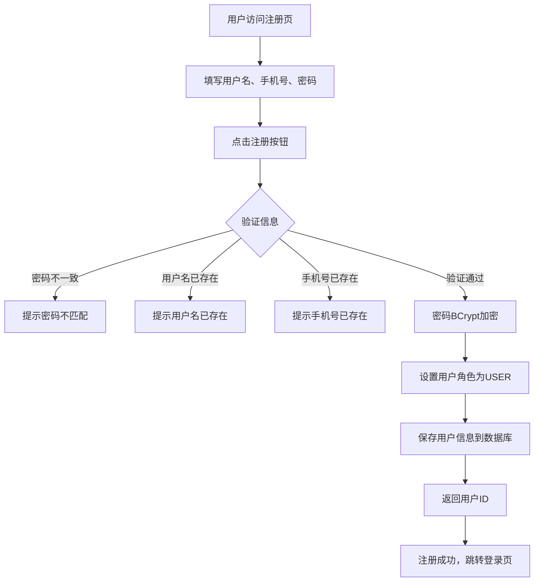
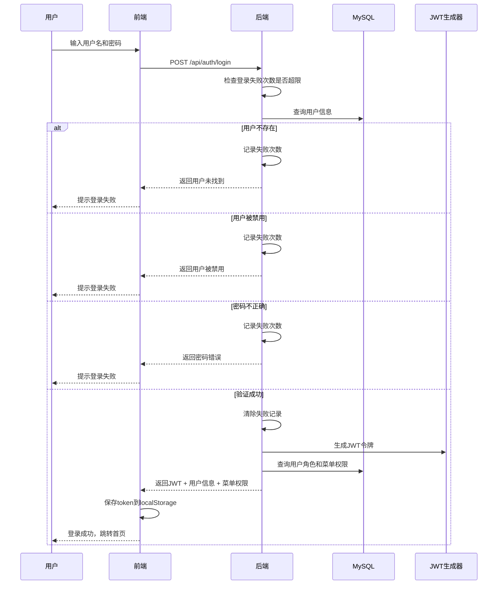
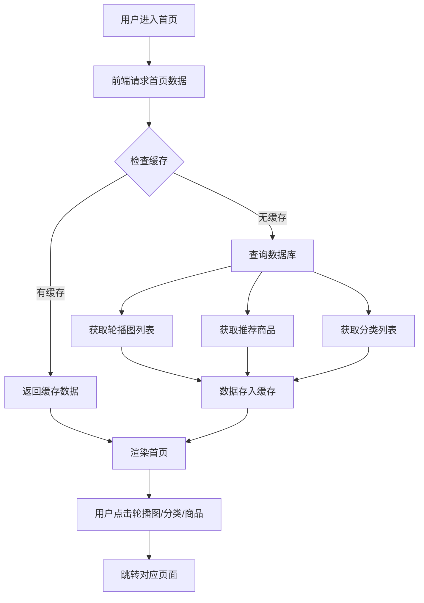
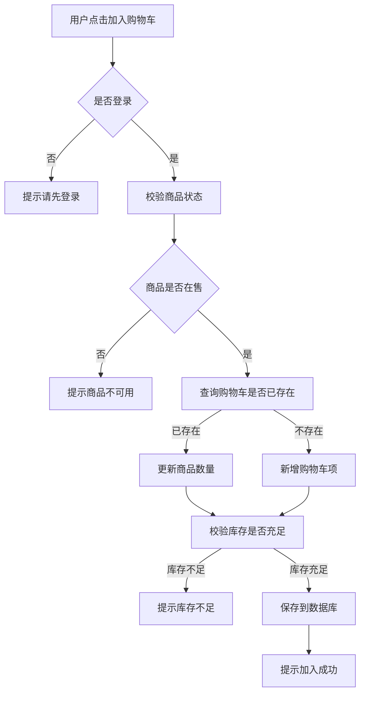
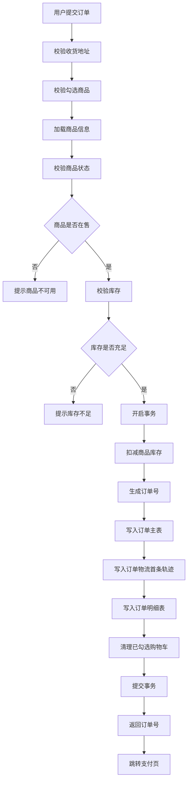
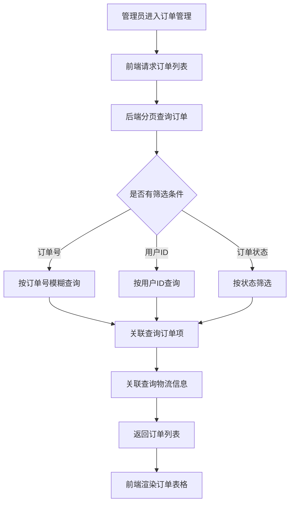
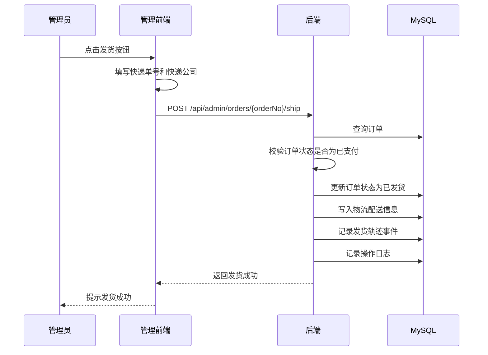
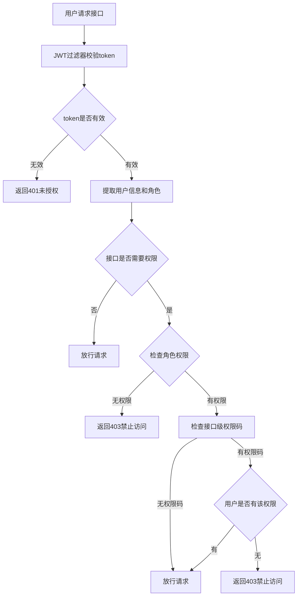

# 任务4：核心业务流程描述

## 1. 用户注册登录流程

### 1.1 用户注册流程



### 1.2 用户登录流程



### 1.3 用户登出流程

1. 用户点击退出按钮
2. 前端调用 `/api/auth/logout` 接口
3. 后端将token加入黑名单
4. 清除SecurityContext
5. 前端清除localStorage中的token、用户信息等
6. 跳转至登录页

---

## 2. 商品浏览流程

### 2.1 首页浏览流程



### 2.2 商品搜索与列表流程

1. 用户在首页或分类页点击搜索/浏览
2. 前端调用商品列表接口，传入关键词或分类ID
3. 后端根据条件分页查询商品表
4. 返回商品列表（包含名称、价格、封面图、库存等）
5. 前端渲染商品列表页
6. 用户点击商品，进入商品详情页

### 2.3 商品详情流程

1. 用户点击商品进入详情页
2. 前端调用商品详情接口
3. 后端查询商品详情、商品图片
4. 返回商品完整信息
5. 前端渲染详情页（价格、库存、图文详情等）
6. 用户可点击"加入购物车"或"立即购买"

---

## 3. 购物车管理流程

### 3.1 加入购物车流程



### 3.2 购物车列表与操作流程

1. 用户进入购物车页面
2. 前端请求购物车列表接口
3. 后端查询当前用户的所有购物车项
4. 关联查询商品信息
5. 返回购物车列表数据
6. 前端渲染购物车页面，展示商品列表和金额汇总

### 3.3 购物车操作

- **修改数量**：用户点击+/-按钮，前端调用更新接口，后端校验库存后更新数量
- **勾选/取消勾选**：用户勾选商品，前端调用更新接口，更新checked状态
- **删除商品**：用户点击删除，前端调用删除接口，后端删除该项
- **全选/取消全选**：前端批量更新所有商品的checked状态

---

## 4. 订单处理流程

### 4.1 订单确认流程

1. 用户在购物车点击"去结算"
2. 前端校验是否有勾选商品
3. 前端调用订单预览接口 `/api/orders/pre`
4. 后端查询勾选的购物车商品、用户地址列表
5. 返回商品清单、地址列表、总金额
6. 前端渲染订单确认页

### 4.2 创建订单流程（核心事务）



### 4.3 订单支付流程

1. 用户在支付页点击"立即支付"
2. 前端调用支付接口 `/api/orders/{orderNo}/pay`
3. 后端校验订单状态是否为"待支付"
4. 校验支付金额是否匹配
5. 更新订单状态为"已支付"
6. 记录支付完成的物流轨迹
7. 通知商户有新订单
8. 前端提示支付成功，跳转订单列表

### 4.4 订单确认收货流程

1. 用户在订单详情页点击"确认收货"
2. 前端调用确认收货接口
3. 后端校验订单状态是否为"已发货"
4. 更新订单状态为"已完成"
5. 记录确认收货的物流轨迹
6. 前端提示确认成功

### 4.5 订单物流追踪流程

1. 用户点击"查看物流"
2. 前端调用物流轨迹接口
3. 后端查询该订单的所有物流轨迹事件
4. 按时间排序返回
5. 如果没有轨迹记录，生成默认轨迹
6. 前端渲染物流时间线

---

## 5. 后台管理流程

### 5.1 管理员登录流程

1. 管理员访问后台登录页
2. 输入用户名和密码
3. 前端调用登录接口
4. 后端校验账号密码
5. 校验角色是否为ADMIN
6. 返回JWT、管理员信息、菜单权限
7. 前端保存token，跳转后台首页

### 5.2 订单管理流程

#### 5.2.1 订单列表查询



#### 5.2.2 订单发货流程



#### 5.2.3 添加物流轨迹流程

1. 管理员在订单详情页点击"添加轨迹"
2. 填写轨迹标题、描述、位置、时间
3. 前端调用添加轨迹接口
4. 后端保存轨迹事件到数据库
5. 记录操作日志
6. 前端提示添加成功

#### 5.2.4 订单导出流程

1. 管理员点击"导出订单"
2. 前端请求导出接口
3. 后端根据筛选条件查询订单
4. 使用POI生成Excel文件
5. 写入响应流，设置下载头
6. 前端下载Excel文件
7. 记录导出操作日志

### 5.3 商品管理流程

1. **商品列表**：分页查询商品，支持按分类、状态筛选
2. **新增商品**：填写商品信息、上传图片、设置分类和库存
3. **编辑商品**：修改商品信息，可更新图片
4. **上架/下架**：切换商品状态
5. **删除商品**：逻辑删除或物理删除商品

### 5.4 用户管理流程

1. **用户列表**：分页查询用户，支持按用户名、手机号搜索
2. **新增用户**：管理员创建用户账号，设置角色
3. **编辑用户**：修改用户信息，可重置密码
4. **禁用/启用**：切换用户状态
5. **分配角色**：给用户分配不同角色（USER/ADMIN）

### 5.5 权限管理流程

#### 5.5.1 菜单管理

- 菜单列表：树形展示菜单结构
- 新增菜单：设置菜单名称、路径、图标、权限码
- 编辑菜单：修改菜单信息
- 删除菜单：级联删除子菜单

#### 5.5.2 角色管理

- 角色列表：展示所有角色
- 新增角色：设置角色名称、角色key
- 编辑角色：修改角色信息
- 分配菜单：给角色分配可访问的菜单
- 删除角色：删除角色（需检查是否有用户使用）

#### 5.5.3 权限校验流程



### 5.6 统计分析流程

1. 管理员进入统计看板
2. 前端请求统计数据接口
3. 后端查询：
   - 订单总数、总金额
   - 用户总数
   - 商品总数
   - 热销商品排行
   - 订单趋势（按日期）
4. 返回统计数据
5. 前端渲染图表和数据卡片

---

## 附录：核心数据表关系

```
user (用户表)
  ├─ id
  ├─ username
  ├─ password_hash (BCrypt加密)
  ├─ phone
  ├─ role_id
  └─ status

role (角色表)
  ├─ id
  ├─ role_name
  └─ role_key

menu (菜单表)
  ├─ id
  ├─ parent_id
  ├─ name
  ├─ path
  ├─ perm_code
  └─ icon

product (商品表)
  ├─ id
  ├─ name
  ├─ price
  ├─ stock
  ├─ category_id
  ├─ cover_url
  └─ status

cart_item (购物车表)
  ├─ id
  ├─ user_id
  ├─ product_id
  ├─ quantity
  └─ checked

order (订单表)
  ├─ id
  ├─ order_no
  ├─ user_id
  ├─ total_amount
  ├─ status (0待支付/1已支付/2已发货/3已完成)
  ├─ address_snapshot
  ├─ created_at
  ├─ paid_at
  ├─ shipped_at
  └─ finished_at

order_item (订单项表)
  ├─ id
  ├─ order_id
  ├─ product_id
  ├─ product_name_snapshot
  ├─ price_snapshot
  ├─ quantity
  └─ image_snapshot

order_tracking_event (物流轨迹表)
  ├─ id
  ├─ order_id
  ├─ status
  ├─ title
  ├─ description
  ├─ location
  └─ event_time
```
