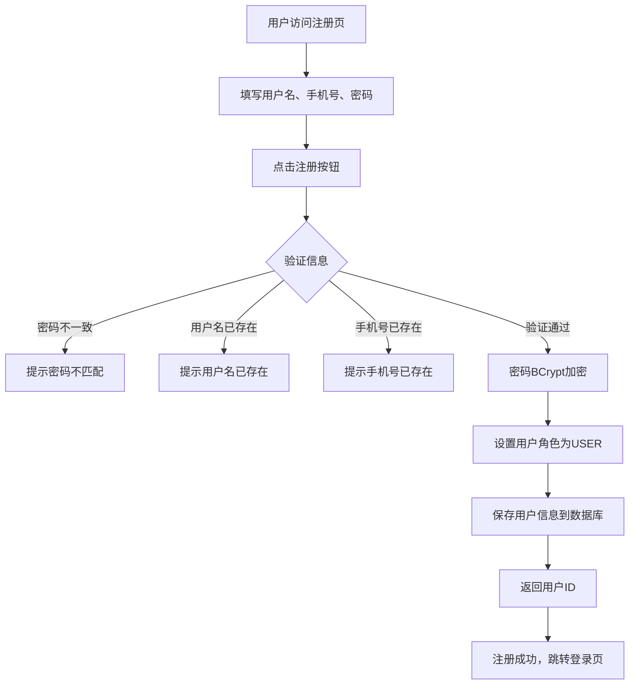
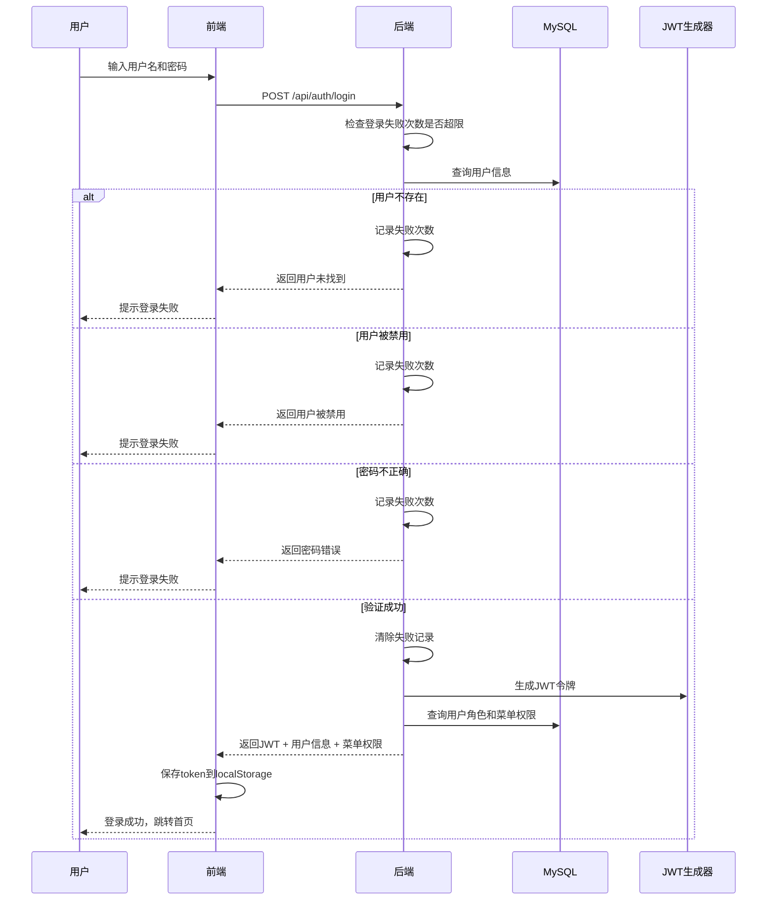
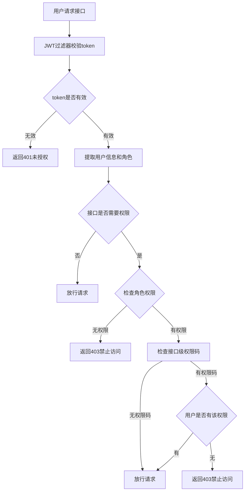
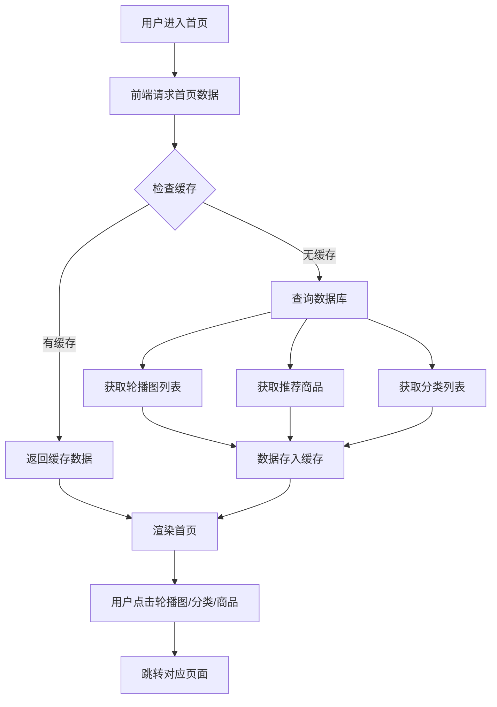
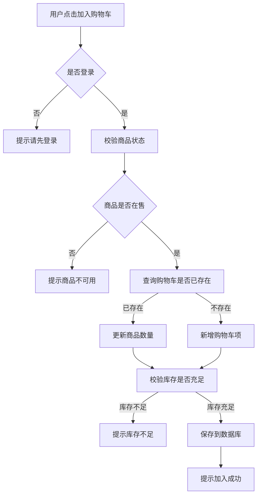
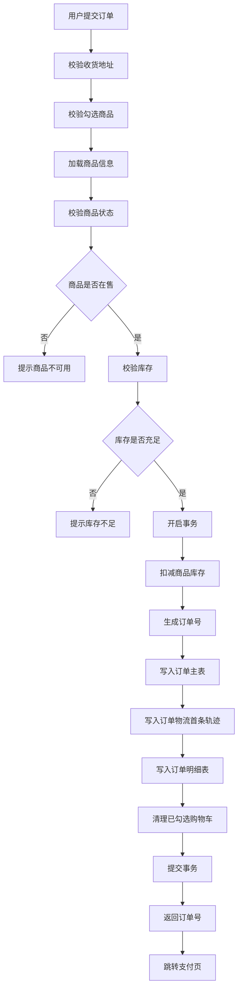
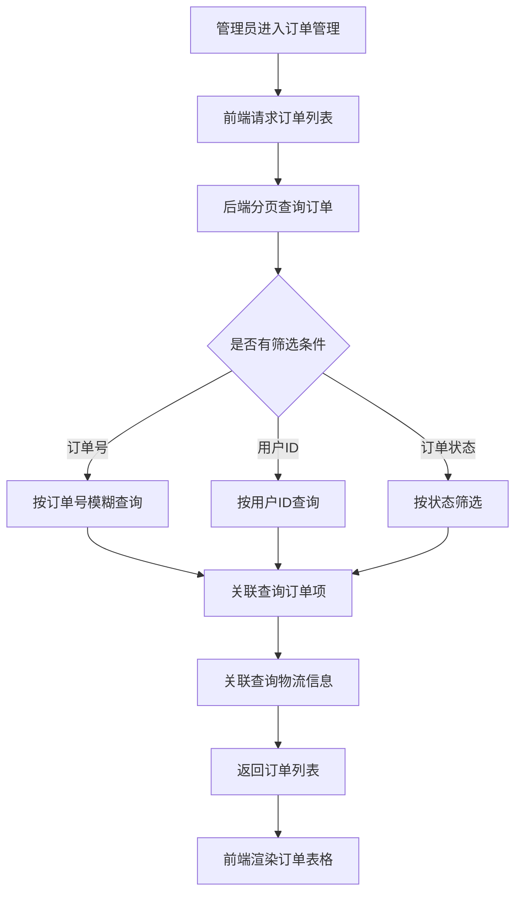
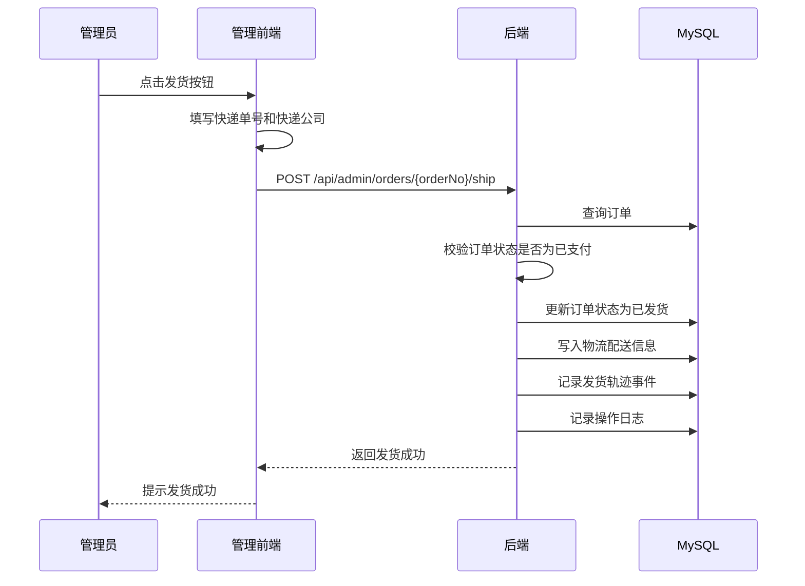

# 第5章 系统实现

本章详细描述3C电子购物商城系统的具体实现，包括开发环境配置、核心功能模块实现、界面展示、业务流程说明及关键代码实现。通过界面截图、流程描述和代码嵌入，完整展示系统的开发过程和实现细节。

## 5.1 开发环境与项目结构

### 5.1.1 开发环境配置

系统采用前后端分离架构进行开发，主要技术栈和环境配置如下。

#### 后端开发环境

- **JDK版本**：17
- **Spring Boot版本**：3.5.10
- **关键依赖**：Spring Web、Spring Security、Validation、MyBatis-Plus、JWT、POI
- **配置文件**：`backend-mall/src/main/resources/application.yml`
- **数据源**：MySQL `mall_db`
- **缓存策略**：应用内缓存 TTL（首页/商品列表/商品详情）
- **登录安全**：失败次数限制与锁定时间

#### 前端开发环境

- **Vue版本**：3.5.x
- **路由管理**：Vue Router 4
- **状态管理**：Pinia
- **构建工具**：Vite
- **UI组件库**：Element Plus + TailwindCSS
- **入口路由**：`frontend-mall/frontend-mall/src/router/index.js`

#### 部署方式

- **本地开发**：`mvn spring-boot:run` + `npm run dev`
- **容器部署**：`docker-compose.yml`（MySQL + Backend + Frontend + Nginx）

### 5.1.2 项目结构与功能映射

#### 前台用户核心功能映射

| 功能       | 前端页面                                                               | 前端 API                | 后端 Controller           | 后端 Service               | 核心数据表                                                        |
| -------- | ------------------------------------------------------------------ | --------------------- | ----------------------- | ------------------------ | ------------------------------------------------------------ |
| 注册/登录/退出 | `Login.vue` `Register.vue`                                         | `src/api/auth.js`     | `AuthController`        | `AuthServiceImpl`        | `user` `role` `menu` `role_menu`                             |
| 首页轮播与推荐  | `Home.vue`                                                         | `src/api/home.js`     | `HomeController`        | `HomeServiceImpl`        | `banner` `product` `category`                                |
| 商品搜索与详情  | `ProductList.vue` `ProductDetail.vue`                              | `src/api/product.js`  | `ProductController`     | `ProductServiceImpl`     | `product` `product_image`                                    |
| 分类浏览     | `CategoryBrowse.vue`                                               | `src/api/category.js` | `CategoryController`    | `CategoryServiceImpl`    | `category` `product`                                         |
| 购物车管理    | `Cart.vue`                                                         | `src/api/cart.js`     | `CartController`        | `CartServiceImpl`        | `cart_item` `product`                                        |
| 地址管理     | `Address.vue`                                                      | `src/api/address.js`  | `AddressController`     | `AddressServiceImpl`     | `address`                                                    |
| 订单全流程    | `OrderConfirm.vue` `OrderPay.vue` `OrderList.vue` `OrderTrack.vue` | `src/api/order.js`    | `OrderController`       | `OrderServiceImpl`       | `order` `order_item` `order_delivery` `order_tracking_event` |
| 个人中心     | `UserProfile.vue`                                                  | `src/api/user.js`     | `UserProfileController` | `UserProfileServiceImpl` | `user` `user_favorite` `user_footprint`                      |

#### 后台管理核心功能映射

| 功能            | 前端页面                                      | 前端 API                                                    | 后端 Controller                                      | 后端 Service                                           | 核心数据表                                                        |
| ------------- | ----------------------------------------- | --------------------------------------------------------- | -------------------------------------------------- | ---------------------------------------------------- | ------------------------------------------------------------ |
| 用户管理          | `AdminUsers.vue`                          | `src/api/admin/users.js`                                  | `AdminUserController`                              | `AdminUserServiceImpl`                               | `user` `role`                                                |
| 菜单与角色权限       | `AdminMenus.vue` `AdminRoles.vue`         | `src/api/admin/menus.js` `src/api/admin/roles.js`         | `AdminMenuController` `AdminRoleController`        | `AdminMenuServiceImpl` `AdminRoleServiceImpl`        | `menu` `role` `role_menu`                                    |
| 商品与分类         | `AdminProducts.vue` `AdminCategories.vue` | `src/api/admin/products.js` `src/api/admin/categories.js` | `AdminProductController` `AdminCategoryController` | `AdminProductServiceImpl` `AdminCategoryServiceImpl` | `product` `category` `product_image`                         |
| 轮播图管理         | `AdminBanners.vue`                        | `src/api/admin/banners.js`                                | `AdminBannerController`                            | `AdminBannerServiceImpl`                             | `banner`                                                     |
| 订单管理/发货/轨迹/导出 | `AdminOrders.vue`                         | `src/api/admin/orders.js`                                 | `AdminOrderController`                             | `AdminOrderServiceImpl`                              | `order` `order_item` `order_delivery` `order_tracking_event` |
| 统计分析          | `AdminStats.vue`                          | `src/api/admin/stats.js`                                  | `AdminStatsController`                             | `AdminStatsServiceImpl`                              | `order` `order_item`                                         |

### 5.1.3 系统分层设计

系统采用经典的分层架构设计，各层职责明确，耦合度低：

- **表现层**：Vue 页面 + 路由 + API 封装
- **接口层**：Spring MVC Controller（参数校验与统一返回）
- **业务层**：Service（业务规则、事务、状态流转）
- **持久层**：Repository（MyBatis-Plus）
- **公共层**：JWT 安全、统一异常、上传、缓存、审计日志

关键设计点包括：

- 安全：Spring Security + JWT + 接口级权限校验
- 事务：下单流程使用事务保证订单与库存一致性
- 状态机：订单状态 `待支付 -> 已支付 -> 已发货 -> 已完成`
- 扩展：物流轨迹事件独立表 `order_tracking_event`
- 运维：支持 Docker Compose 与 Nginx 反向代理

## 5.2 用户与权限模块实现

### 5.2.1 用户注册与登录流程

#### 用户注册流程

用户注册流程用于完成新用户账号的创建，包括信息验证、密码加密和角色分配等步骤。



#### 用户登录流程

用户登录流程实现身份认证，包括账号密码验证、JWT令牌生成和权限信息返回。



#### 用户登出流程

1. 用户点击退出按钮
2. 前端调用 `/api/auth/logout` 接口
3. 后端将token加入黑名单
4. 清除SecurityContext
5. 前端清除localStorage中的token、用户信息等
6. 跳转至登录页

### 5.2.2 登录界面实现

登录页面采用现代化设计，包含背景图片、毛玻璃效果和响应式布局，支持"记住我"功能和中英文双语切换。

!\[图5.2]\(screenshots/图5.2.png null)

### 5.2.3 注册界面实现

注册页面采用与登录页面一致的设计风格，包含用户名、手机号、密码和确认密码等输入项。

!\[图5.3]\(screenshots/图5.3.png null)

### 5.2.4 用户认证核心代码实现

#### 认证控制器（AuthController.java）

```java
package com.thinking.backendmall.controller;

import com.thinking.backendmall.common.Result;
import com.thinking.backendmall.config.security.AuthContext;
import com.thinking.backendmall.dto.AuthLoginRequest;
import com.thinking.backendmall.dto.AuthRegisterRequest;
import com.thinking.backendmall.service.AuthService;
import com.thinking.backendmall.service.MenuService;
import jakarta.servlet.http.HttpServletRequest;
import jakarta.servlet.http.HttpServletResponse;
import jakarta.validation.Valid;
import org.springframework.beans.factory.annotation.Autowired;
import org.springframework.security.access.prepost.PreAuthorize;
import org.springframework.security.core.Authentication;
import org.springframework.security.core.context.SecurityContextHolder;
import org.springframework.security.web.authentication.logout.SecurityContextLogoutHandler;
import org.springframework.web.bind.annotation.*;

import java.util.Map;

@RestController
@RequestMapping("/api/auth")
public class AuthController {

    @Autowired
    private AuthService authService;

    @Autowired
    private MenuService menuService;

    @PostMapping("/register")
    // 功能：用户注册接口
    public Result<Map<String, Object>> register(@Valid @RequestBody AuthRegisterRequest body) {
        Map<String, Object> result = authService.register(
                body.getUsername(),
                body.getPhone(),
                body.getPassword(),
                body.getConfirmPassword());
        return Result.success(result);
    }

    @PostMapping("/login")
    // 功能：用户登录接口
    public Result<Map<String, Object>> login(@Valid @RequestBody AuthLoginRequest body) {
        Map<String, Object> result = authService.login(body.getUsername(), body.getPassword());
        return Result.success(result);
    }

    @PostMapping("/logout")
    @PreAuthorize("isAuthenticated()")
    // 功能：用户退出登录接口
    public Result<Void> logout(HttpServletRequest request, HttpServletResponse response) {
        String header = request.getHeader("Authorization");
        if (header != null && header.startsWith("Bearer ")) {
            authService.logout(header.substring(7));
        }
        Authentication authentication = SecurityContextHolder.getContext().getAuthentication();
        if (authentication != null) {
            new SecurityContextLogoutHandler().logout(request, response, authentication);
        }
        return Result.success();
    }

    @GetMapping("/me")
    @PreAuthorize("isAuthenticated()")
    // 功能：获取当前用户信息接口
    public Result<Map<String, Object>> me() {
        Long userId = AuthContext.getUserId();
        String username = AuthContext.getUsername();
        String roleKey = AuthContext.getRoleKey();
        Map<String, Object> result = new java.util.HashMap<>();
        result.put("userId", userId);
        result.put("username", username);
        result.put("roleKey", roleKey);
        result.put("menus", menuService.listMyMenus(roleKey));
        result.put("perms", menuService.listMyPerms(roleKey));
        return Result.success(result);
    }
}
```

#### 认证服务实现（AuthServiceImpl.java）

```java
package com.thinking.backendmall.service.impl;

import com.baomidou.mybatisplus.core.conditions.query.LambdaQueryWrapper;
import com.thinking.backendmall.common.BusinessException;
import com.thinking.backendmall.config.JwtUtil;
import com.thinking.backendmall.config.security.AuthMemoryStore;
import com.thinking.backendmall.entity.Role;
import com.thinking.backendmall.entity.User;
import com.thinking.backendmall.repository.RoleRepository;
import com.thinking.backendmall.repository.UserRepository;
import com.thinking.backendmall.service.AuthService;
import com.thinking.backendmall.service.MenuService;
import org.springframework.beans.factory.annotation.Autowired;
import org.springframework.beans.factory.annotation.Value;
import org.springframework.security.crypto.password.PasswordEncoder;
import org.springframework.stereotype.Service;

import java.time.LocalDateTime;
import java.util.HashMap;
import java.util.Map;

@Service
public class AuthServiceImpl implements AuthService {

    @Autowired
    private UserRepository userRepository;

    @Autowired
    private RoleRepository roleRepository;

    @Autowired
    private JwtUtil jwtUtil;

    @Autowired
    private MenuService menuService;

    @Autowired
    private AuthMemoryStore authMemoryStore;

    @Value("${app.login.max-attempts:5}")
    private int maxAttempts;

    @Value("${app.login.lock-seconds:900}")
    private long lockSeconds;

    private final PasswordEncoder passwordEncoder;

    @Autowired
    // 功能：初始化认证服务所需的密码加密器
    public AuthServiceImpl(PasswordEncoder passwordEncoder) {
        this.passwordEncoder = passwordEncoder;
    }

    @Override
    // 功能：注册账号并写入用户信息
    public Map<String, Object> register(String username, String phone, String password, String confirmPassword) {
        if (!password.equals(confirmPassword)) {
            throw new BusinessException("Passwords do not match");
        }
        User existingByUsername = userRepository.selectOne(
                new LambdaQueryWrapper<User>().eq(User::getUsername, username));
        if (existingByUsername != null) {
            throw new BusinessException("Username already exists");
        }
        User existingByPhone = userRepository.selectOne(
                new LambdaQueryWrapper<User>().eq(User::getPhone, phone));
        if (existingByPhone != null) {
            throw new BusinessException("Phone already exists");
        }

        User user = new User();
        user.setUsername(username);
        user.setPhone(phone);
        user.setPasswordHash(passwordEncoder.encode(password));
        user.setStatus(1);
        Role userRole = roleRepository.selectOne(
                new LambdaQueryWrapper<Role>().eq(Role::getRoleKey, "USER"));
        if (userRole != null) {
            user.setRoleId(userRole.getId());
        }
        user.setCreatedAt(LocalDateTime.now());
        userRepository.insert(user);

        Map<String, Object> result = new HashMap<>();
        result.put("userId", user.getId());
        return result;
    }

    @Override
    // 功能：校验账号密码并返回登录信息
    public Map<String, Object> login(String username, String password) {
        if (authMemoryStore.isLocked(username, maxAttempts)) {
            throw new BusinessException("Too many login attempts. Please try later.");
        }
        User user = userRepository.selectOne(
                new LambdaQueryWrapper<User>().eq(User::getUsername, username));
        if (user == null) {
            authMemoryStore.recordFailure(username, lockSeconds);
            throw new BusinessException("User not found");
        }
        if (user.getStatus() != 1) {
            authMemoryStore.recordFailure(username, lockSeconds);
            throw new BusinessException("User is disabled");
        }
        if (!passwordEncoder.matches(password, user.getPasswordHash())) {
            authMemoryStore.recordFailure(username, lockSeconds);
            throw new BusinessException("Invalid password");
        }
        authMemoryStore.clearFailure(username);

        Role role = roleRepository.selectById(user.getRoleId());
        String roleKey = role != null ? role.getRoleKey() : "USER";

        String token = jwtUtil.generateToken(user.getUsername(), user.getId(), roleKey);

        Map<String, Object> result = new HashMap<>();
        result.put("token", token);
        result.put("userId", user.getId());
        result.put("roleKey", roleKey);
        result.put("menus", menuService.listMyMenus(roleKey));
        result.put("perms", menuService.listMyPerms(roleKey));
        return result;
    }

    @Override
    // 功能：登出时将令牌加入本地黑名单
    public void logout(String token) {
        if (token == null || token.isBlank()) {
            return;
        }
        try {
            var claims = jwtUtil.getClaimsFromToken(token);
            long ttl = claims.getExpiration().getTime() - System.currentTimeMillis();
            if (ttl > 0) {
                authMemoryStore.blacklistToken(token, ttl);
            }
        } catch (Exception ex) {
            // Ignore invalid token.
        }
    }
}
```

### 5.2.5 权限控制实现

系统采用基于角色的访问控制（RBAC）模型，结合Spring Security和JWT实现安全认证与权限校验。

#### 权限校验流程



#### 安全配置（SecurityConfig.java）

```java
package com.thinking.backendmall.config.security;

import jakarta.servlet.http.HttpServletRequest;
import org.springframework.context.annotation.Bean;
import org.springframework.context.annotation.Configuration;
import org.springframework.http.HttpMethod;
import org.springframework.security.config.Customizer;
import org.springframework.security.config.annotation.web.builders.HttpSecurity;
import org.springframework.security.config.annotation.method.configuration.EnableMethodSecurity;
import org.springframework.security.config.annotation.web.configurers.AbstractHttpConfigurer;
import org.springframework.security.config.http.SessionCreationPolicy;
import org.springframework.security.crypto.bcrypt.BCryptPasswordEncoder;
import org.springframework.security.crypto.password.PasswordEncoder;
import org.springframework.security.web.SecurityFilterChain;
import org.springframework.security.web.authentication.UsernamePasswordAuthenticationFilter;
import org.springframework.web.cors.CorsConfiguration;
import org.springframework.web.cors.CorsConfigurationSource;

import java.util.List;

@Configuration
@EnableMethodSecurity
public class SecurityConfig {

    @Bean
    // 功能：配置Spring Security过滤器链
    public SecurityFilterChain securityFilterChain(HttpSecurity http,
                                                   JwtAuthenticationFilter jwtAuthenticationFilter,
                                                   RestAuthenticationEntryPoint restAuthenticationEntryPoint,
                                                   RestAccessDeniedHandler restAccessDeniedHandler) throws Exception {
        http.csrf(AbstractHttpConfigurer::disable)
                .httpBasic(AbstractHttpConfigurer::disable)
                .cors(Customizer.withDefaults())
                .sessionManagement(session -> session.sessionCreationPolicy(SessionCreationPolicy.STATELESS))
                .exceptionHandling(handler -> handler
                        .authenticationEntryPoint(restAuthenticationEntryPoint)
                        .accessDeniedHandler(restAccessDeniedHandler))
                .authorizeHttpRequests(auth -> auth
                        .requestMatchers(HttpMethod.OPTIONS, "/**").permitAll()
                        .requestMatchers("/health").permitAll()
                        .requestMatchers("/api/hello").permitAll()
                        .requestMatchers("/swagger-ui/**", "/v3/api-docs/**", "/swagger-ui.html").permitAll()
                        .requestMatchers("/api/auth/**").permitAll()
                        .requestMatchers(HttpMethod.GET, "/api/home/**").permitAll()
                        .requestMatchers(HttpMethod.GET, "/api/products/**").permitAll()
                        .requestMatchers(HttpMethod.GET, "/api/categories/**").permitAll()
                        .requestMatchers("/error")
                        .permitAll()
                        .requestMatchers("/uploads/**").permitAll()
                        .requestMatchers("/api/admin/**").hasRole("ADMIN")
                        .anyRequest().authenticated())
                .addFilterBefore(jwtAuthenticationFilter, UsernamePasswordAuthenticationFilter.class);

        return http.build();
    }

    @Bean
    // 功能：配置密码加密器
    public PasswordEncoder passwordEncoder() {
        return new BCryptPasswordEncoder();
    }

    @Bean
    // 功能：配置跨域配置源
    public CorsConfigurationSource corsConfigurationSource() {
        return (HttpServletRequest request) -> {
            CorsConfiguration configuration = new CorsConfiguration();
            configuration.setAllowedOriginPatterns(List.of("http://localhost:*"));
            configuration.setAllowedMethods(List.of("GET", "POST", "PUT", "DELETE", "OPTIONS"));
            configuration.setAllowedHeaders(List.of("*"));
            configuration.setAllowCredentials(true);
            configuration.setMaxAge(3600L);
            return configuration;
        };
    }
}
```

#### JWT认证过滤器（JwtAuthenticationFilter.java）

```java
package com.thinking.backendmall.config.security;

import com.thinking.backendmall.config.JwtUtil;
import jakarta.servlet.FilterChain;
import jakarta.servlet.ServletException;
import jakarta.servlet.http.HttpServletRequest;
import jakarta.servlet.http.HttpServletResponse;
import org.springframework.beans.factory.annotation.Autowired;
import org.springframework.security.authentication.UsernamePasswordAuthenticationToken;
import org.springframework.security.core.authority.SimpleGrantedAuthority;
import org.springframework.security.core.context.SecurityContextHolder;
import org.springframework.security.web.authentication.WebAuthenticationDetailsSource;
import org.springframework.stereotype.Component;
import org.springframework.web.filter.OncePerRequestFilter;

import java.io.IOException;
import java.util.List;

@Component
public class JwtAuthenticationFilter extends OncePerRequestFilter {

    @Autowired
    private JwtUtil jwtUtil;

    @Autowired
    private AuthMemoryStore authMemoryStore;

    @Override
    // 功能：JWT认证过滤器，校验token并设置认证上下文
    protected void doFilterInternal(HttpServletRequest request,
                                    HttpServletResponse response,
                                    FilterChain filterChain) throws ServletException, IOException {
        String header = request.getHeader("Authorization");
        if (header != null && header.startsWith("Bearer ")) {
            String token = header.substring(7);
            if (!authMemoryStore.isTokenBlacklisted(token)) {
                try {
                    var claims = jwtUtil.getClaimsFromToken(token);
                    String username = claims.getSubject();
                    Long userId = claims.get("userId", Long.class);
                    String roleKey = claims.get("roleKey", String.class);

                    AuthContext.setUserId(userId);
                    AuthContext.setUsername(username);
                    AuthContext.setRoleKey(roleKey);

                    List<SimpleGrantedAuthority> authorities = List.of(new SimpleGrantedAuthority("ROLE_" + roleKey));
                    UsernamePasswordAuthenticationToken authentication =
                            new UsernamePasswordAuthenticationToken(username, null, authorities);
                    authentication.setDetails(new WebAuthenticationDetailsSource().buildDetails(request));
                    SecurityContextHolder.getContext().setAuthentication(authentication);
                } catch (Exception e) {
                    SecurityContextHolder.clearContext();
                }
            }
        }
        try {
            filterChain.doFilter(request, response);
        } finally {
            AuthContext.clear();
        }
    }
}
```

### 5.2.6 前端登录与认证实现

#### 登录页面（Login.vue）

```vue
<template>
  <div class="relative flex min-h-screen items-center justify-center overflow-hidden px-4 py-10">
    <div class="absolute inset-0 bg-[url('https://images.unsplash.com/photo-1497366754035-f200968a6e72?auto=format&fit=crop&w=1920&q=80')] bg-cover bg-center"></div>
    <div class="absolute inset-0 bg-slate-900/45 backdrop-blur-[3px]"></div>

    <div class="relative z-10 w-full max-w-[520px] space-y-5">
      <div class="rounded-3xl border border-white/40 bg-white/92 shadow-2xl backdrop-blur-md">
        <div class="border-b border-slate-200/80 px-10 pb-8 pt-10 text-center">
          <div class="mx-auto grid h-16 w-16 place-content-center rounded-full bg-blue-100 text-3xl font-bold text-blue-600">AP</div>
          <h1 class="mt-6 text-5xl font-extrabold tracking-tight text-slate-900">{{ t('auth.adminPortal') }}</h1>
          <p class="mt-3 text-lg text-slate-500">{{ t('auth.loginSubtitle') }}</p>
        </div>

        <el-form :model="form" label-position="top" class="space-y-2 px-10 pb-8 pt-8" @keyup.enter="handleLogin">
          <el-form-item :label="t('auth.username')">
            <el-input v-model="form.username" size="large" :placeholder="t('auth.username')" />
          </el-form-item>

          <el-form-item :label="t('auth.password')">
            <el-input
              v-model="form.password"
              size="large"
              type="password"
              show-password
              :placeholder="t('auth.password')"
            />
          </el-form-item>

          <div class="flex items-center justify-between pb-1 pt-1 text-sm">
            <el-checkbox v-model="remember">{{ t('auth.rememberMe') }}</el-checkbox>
            <button class="text-blue-600 hover:text-blue-700" type="button" @click="handleForgotPassword">
              {{ t('auth.forgotPassword') }}
            </button>
          </div>

          <el-button class="mt-2 w-full" size="large" type="primary" :loading="loading" @click="handleLogin">
            {{ t('auth.login') }}
          </el-button>
        </el-form>

        <div class="border-t border-slate-200/80 px-10 py-5 text-center text-sm text-slate-500">
          {{ t('auth.secureBy') }}
        </div>
      </div>
      <div class="text-center text-white/90">
        <button type="button" class="text-base hover:text-white" @click="router.push('/')">{{ t('auth.backToStore') }}</button>
        <div class="mt-2 text-sm">
          {{ t('auth.noAccount') }}
          <el-link class="!text-white" @click="router.push('/register')">{{ t('auth.toRegister') }}</el-link>
        </div>
      </div>
    </div>
  </div>
</template>

<script setup>
import { onMounted, ref } from 'vue'
import { useRouter } from 'vue-router'
import { ElMessage } from 'element-plus'
import { login } from '@/api/auth.js'
import { useAuth } from '@/composables/useAuth.js'
import { useI18n } from '@/i18n/index.js'

const router = useRouter()
const loading = ref(false)
const remember = ref(false)
const form = ref({
  username: '',
  password: '',
})
const { refreshAuth } = useAuth()
const { t } = useI18n()

onMounted(() => {
  const rememberedUsername = localStorage.getItem('rememberedUsername')
  if (rememberedUsername) {
    form.value.username = rememberedUsername
    remember.value = true
  }
})

// 功能：处理忘记密码
const handleForgotPassword = () => {
  ElMessage.info(t('auth.contactAdminReset'))
}

// 功能：处理登录
const handleLogin = async () => {
  if (!form.value.username || !form.value.password) {
    ElMessage.warning(t('auth.completeInfo'))
    return
  }

  loading.value = true
  try {
    const res = await login(form.value)
    if (res.code === 200) {
      localStorage.setItem('token', res.data.token)
      localStorage.setItem('userId', res.data.userId)
      localStorage.setItem('roleKey', res.data.roleKey)
      localStorage.setItem('menus', JSON.stringify(res.data.menus || []))
      localStorage.setItem('perms', JSON.stringify(res.data.perms || []))
      if (remember.value) {
        localStorage.setItem('rememberedUsername', form.value.username)
      } else {
        localStorage.removeItem('rememberedUsername')
      }
      refreshAuth()
      window.dispatchEvent(new Event('auth-changed'))
      ElMessage.success(t('auth.loginSuccess'))
      router.push(res.data.roleKey === 'ADMIN' ? '/admin' : '/')
    } else {
      ElMessage.error(res.message)
    }
  } catch {
    ElMessage.error(t('auth.loginFail'))
  } finally {
    loading.value = false
  }
}
</script>
```

#### 认证API（auth.js）

```javascript
import request from './request.js'

// 功能：注册账号
export const register = (data) => {
    return request.post('/api/auth/register', data)
}

// 功能：登录系统
export const login = (data) => {
    return request.post('/api/auth/login', data)
}

// 功能：退出登录
export const logout = () => {
    return request.post('/api/auth/logout')
}

// 功能：获取当前用户信息
export const me = () => {
    return request.get('/api/auth/me')
}
```

## 5.3 商品与购物车模块实现

### 5.3.1 商品浏览流程

#### 首页浏览流程



#### 商品搜索与列表流程

1. 用户在首页或分类页点击搜索/浏览
2. 前端调用商品列表接口，传入关键词或分类ID
3. 后端根据条件分页查询商品表
4. 返回商品列表（包含名称、价格、封面图、库存等）
5. 前端渲染商品列表页
6. 用户点击商品，进入商品详情页

#### 商品详情流程

1. 用户点击商品进入详情页
2. 前端调用商品详情接口
3. 后端查询商品详情、商品图片
4. 返回商品完整信息
5. 前端渲染详情页（价格、库存、图文详情等）
6. 用户可点击"加入购物车"或"立即购买"

### 5.3.2 首页与商品详情界面

首页展示轮播图、推荐商品和分类导航，为用户提供便捷的商品浏览入口。

!\[图5.1]\(screenshots/图5.1.png null)

商品列表页支持按分类筛选和关键词搜索，展示商品基本信息。

!\[图5.4]\(screenshots/图5.4.png null)

商品详情页展示商品详细信息、价格、库存和图文详情，支持加入购物车和立即购买。

!\[图5.5]\(screenshots/图5.5.png null)

### 5.3.3 购物车管理流程

#### 加入购物车流程



#### 购物车列表与操作流程

1. 用户进入购物车页面
2. 前端请求购物车列表接口
3. 后端查询当前用户的所有购物车项
4. 关联查询商品信息
5. 返回购物车列表数据
6. 前端渲染购物车页面，展示商品列表和金额汇总

#### 购物车操作

- **修改数量**：用户点击+/-按钮，前端调用更新接口，后端校验库存后更新数量
- **勾选/取消勾选**：用户勾选商品，前端调用更新接口，更新checked状态
- **删除商品**：用户点击删除，前端调用删除接口，后端删除该项
- **全选/取消全选**：前端批量更新所有商品的checked状态

### 5.3.4 购物车界面

购物车页面展示已加入购物车的商品，支持调整数量、勾选结算和删除商品等操作。

!\[图5.6]\(screenshots/图5.6.png null)

### 5.3.5 购物车核心代码实现

#### 购物车服务实现（CartServiceImpl.java）

```java
package com.thinking.backendmall.service.impl;

import com.baomidou.mybatisplus.core.conditions.query.LambdaQueryWrapper;
import com.thinking.backendmall.common.BusinessException;
import com.thinking.backendmall.entity.CartItem;
import com.thinking.backendmall.entity.Product;
import com.thinking.backendmall.repository.CartItemRepository;
import com.thinking.backendmall.repository.ProductRepository;
import com.thinking.backendmall.service.CartService;
import com.thinking.backendmall.vo.CartItemView;
import org.springframework.beans.factory.annotation.Autowired;
import org.springframework.stereotype.Service;
import org.springframework.transaction.annotation.Transactional;

import java.math.BigDecimal;
import java.time.LocalDateTime;
import java.util.ArrayList;
import java.util.HashMap;
import java.util.List;
import java.util.Map;

@Service
public class CartServiceImpl implements CartService {

    @Autowired
    private CartItemRepository cartItemRepository;

    @Autowired
    private ProductRepository productRepository;

    @Override
    @Transactional
    // 功能：新增到购物车
    public void addToCart(Long userId, Long productId, Integer quantity) {
        if (productId == null) {
            throw new BusinessException("ProductId is required");
        }
        int qty = quantity == null || quantity <= 0 ? 1 : quantity;
        Product product = productRepository.selectById(productId);
        if (product == null || !"ON".equals(product.getStatus())) {
            throw new BusinessException("Product not available");
        }

        CartItem existing = cartItemRepository.selectOne(new LambdaQueryWrapper<CartItem>()
                .eq(CartItem::getUserId, userId)
                .eq(CartItem::getProductId, productId));

        int existingQty = existing == null ? 0 : existing.getQuantity();
        Integer stock = product.getStock();
        if (stock != null && existingQty + qty > stock) {
            throw new BusinessException("Insufficient stock");
        }

        if (existing != null) {
            existing.setQuantity(existing.getQuantity() + qty);
            cartItemRepository.updateById(existing);
            return;
        }

        CartItem item = new CartItem();
        item.setUserId(userId);
        item.setProductId(productId);
        item.setQuantity(qty);
        item.setChecked(1);
        item.setCreatedAt(LocalDateTime.now());
        cartItemRepository.insert(item);
    }

    @Override
    // 功能：查询购物车明细
    public List<CartItemView> listCartItems(Long userId) {
        List<CartItem> items = cartItemRepository.selectList(new LambdaQueryWrapper<CartItem>()
                .eq(CartItem::getUserId, userId));
        if (items.isEmpty()) {
            return new ArrayList<>();
        }
        List<Long> productIds = new ArrayList<>();
        for (CartItem item : items) {
            productIds.add(item.getProductId());
        }
        List<Product> products = productRepository.selectBatchIds(productIds);
        Map<Long, Product> productMap = new HashMap<>();
        for (Product product : products) {
            productMap.put(product.getId(), product);
        }
        List<CartItemView> views = new ArrayList<>();
        for (CartItem item : items) {
            Product product = productMap.get(item.getProductId());
            if (product == null) {
                continue;
            }
            CartItemView view = new CartItemView();
            view.setCartItemId(item.getId());
            view.setProductId(item.getProductId());
            view.setName(product.getName());
            view.setPrice(product.getPrice() == null ? BigDecimal.ZERO : product.getPrice());
            view.setImage(product.getCoverUrl());
            view.setQuantity(item.getQuantity());
            view.setChecked(item.getChecked());
            views.add(view);
        }
        return views;
    }

    @Override
    @Transactional
    // 功能：更新购物车明细
    public void updateCartItem(Long userId, Long cartItemId, Integer quantity, Integer checked) {
        CartItem item = cartItemRepository.selectById(cartItemId);
        if (item == null || !userId.equals(item.getUserId())) {
            throw new BusinessException(404, "Cart item not found");
        }
        if (quantity != null) {
            if (quantity <= 0) {
                throw new BusinessException("Quantity must be positive");
            }
            Product product = productRepository.selectById(item.getProductId());
            if (product == null || !"ON".equals(product.getStatus())) {
                throw new BusinessException("Product not available");
            }
            Integer stock = product.getStock();
            if (stock != null && quantity > stock) {
                throw new BusinessException("Insufficient stock");
            }
            item.setQuantity(quantity);
        }
        if (checked != null) {
            item.setChecked(checked);
        }
        cartItemRepository.updateById(item);
    }

    @Override
    @Transactional
    // 功能：删除购物车明细
    public void deleteCartItem(Long userId, Long cartItemId) {
        CartItem item = cartItemRepository.selectById(cartItemId);
        if (item == null || !userId.equals(item.getUserId())) {
            throw new BusinessException(404, "Cart item not found");
        }
        cartItemRepository.deleteById(cartItemId);
    }
}
```

### 5.3.6 前端购物车实现

#### 购物车页面（Cart.vue）

```vue
<template>
  <div class="grid gap-8 xl:grid-cols-[1fr_380px]">
    <section class="space-y-4">
      <div class="flex items-end justify-between">
        <div>
          <p class="text-sm text-[var(--muted)]">{{ dual('首页', 'Home') }} / {{ t('cart.title') }}</p>
          <h1 class="mt-2 text-5xl font-extrabold">{{ t('cart.title') }} <span class="text-2xl text-[var(--muted)]">({{ cartItems.length }})</span></h1>
        </div>
      </div>

      <article
        v-for="item in cartItems"
        :key="item.cartItemId"
        class="rounded-2xl border border-[var(--line)] bg-[var(--surface)] p-5"
      >
        <div class="flex flex-wrap items-center gap-4 lg:flex-nowrap">
          <el-checkbox
            v-model="item.checked"
            :true-label="1"
            :false-label="0"
            @change="updateChecked(item)"
          />
          
          <div class="min-w-0 flex-1">
            <h3 class="truncate text-3xl font-extrabold">{{ item.name }}</h3>
            <p class="mt-2 text-base text-[var(--muted)]">{{ dual('有库存', 'In Stock') }}</p>
            <div class="mt-2 text-4xl font-extrabold">$ {{ formatPrice(item.price) }}</div>
          </div>
          <div class="flex items-center gap-2 rounded-xl border border-[var(--line)] px-2 py-2">
            <el-button text @click="changeQuantity(item, -1)">-</el-button>
            <span class="w-8 text-center font-bold">{{ item.quantity }}</span>
            <el-button text @click="changeQuantity(item, 1)">+</el-button>
          </div>
          <el-button text type="danger" @click="removeItem(item)">{{ t('common.delete') }}</el-button>
        </div>
      </article>

      <el-empty v-if="!cartItems.length" :description="t('cart.empty')" />
      <el-button text type="primary" @click="router.push('/products')">{{ dual('继续购物', 'Back to Shopping') }}</el-button>
    </section>

    <aside class="h-fit rounded-2xl border border-[var(--line)] bg-[var(--surface)] p-6">
      <h2 class="text-4xl font-extrabold">{{ dual('订单摘要', 'Order Summary') }}</h2>
      <div class="mt-5 space-y-3 text-lg">
        <div class="flex items-center justify-between">
           <span class="text-[var(--muted)]">{{ dual('商品小计', 'Subtotal') }}</span>
          <strong>$ {{ formatPrice(subtotal) }}</strong>
        </div>
        <div class="flex items-center justify-between">
           <span class="text-[var(--muted)]">{{ dual('运费预估', 'Shipping estimate') }}</span>
          <strong>$ {{ formatPrice(shipping) }}</strong>
        </div>
        <div class="flex items-center justify-between">
           <span class="text-[var(--muted)]">{{ dual('税费预估', 'Tax estimate') }}</span>
          <strong>$ {{ formatPrice(tax) }}</strong>
        </div>
      </div>

      <div class="mt-5 flex items-center gap-2">
        <el-input v-model="coupon" :placeholder="dual('礼品卡或优惠码', 'Gift card or discount code')" />
        <el-button @click="applyCoupon">{{ dual('应用', 'Apply') }}</el-button>
      </div>

      <div class="mt-6 border-t border-[var(--line)] pt-6">
        <div class="flex items-center justify-between text-4xl font-extrabold">
          <span>{{ t('common.total') }}</span>
          <span>$ {{ formatPrice(totalAmount) }}</span>
        </div>
        <el-button
          class="mt-5 w-full"
          size="large"
          type="primary"
          :disabled="!checkedItems.length"
          @click="goToCheckout"
        >
          {{ dual('去结算', 'Proceed to Checkout') }}
        </el-button>
      </div>
    </aside>
  </div>
</template>

<script setup>
import { computed, onMounted, ref } from 'vue'
import { useRouter } from 'vue-router'
import { ElMessage } from 'element-plus'
import { deleteCartItem, getCartItems, updateCartItem } from '@/api/cart.js'
import { useI18n } from '@/i18n/index.js'

const router = useRouter()
const cartItems = ref([])
const coupon = ref('')
const discountRate = ref(0)
const { t, locale } = useI18n()
// 功能：处理中英文双语
const dual = (zh, en) => (locale.value === 'zh' ? zh : en)

// 功能：统一价格格式化
const formatPrice = (value) => Number(value || 0).toFixed(2)

// 功能：拉取当前用户购物车数据并渲染列表
const loadCart = async () => {
  try {
    const res = await getCartItems()
    if (res.code === 200) {
      cartItems.value = res.data || []
    } else {
      ElMessage.error(res.message)
    }
  } catch {
    ElMessage.error(t('cart.loadFail'))
  }
}

// 功能：抽取购物车项更新请求，供数量与勾选复用
const syncItem = async (item, payload) => {
  const res = await updateCartItem(item.cartItemId, payload)
  if (res.code !== 200) {
    throw new Error(res.message || t('cart.updateFail'))
  }
}

// 功能：修改商品数量，失败时回滚到修改前
const changeQuantity = async (item, delta) => {
  const next = item.quantity + delta
  if (next < 1) {
    return
  }
  const previous = item.quantity
  item.quantity = next
  try {
    await syncItem(item, { quantity: next })
  } catch (error) {
    item.quantity = previous
    ElMessage.error(error.message || t('cart.updateFail'))
  }
}

// 功能：修改勾选状态，失败时回滚勾选值
const updateChecked = async (item) => {
  try {
    await syncItem(item, { checked: item.checked })
  } catch (error) {
    item.checked = item.checked === 1 ? 0 : 1
    ElMessage.error(error.message || t('cart.updateFail'))
  }
}

// 功能：删除购物车项并同步刷新本地列表
const removeItem = async (item) => {
  try {
    const res = await deleteCartItem(item.cartItemId)
    if (res.code === 200) {
      cartItems.value = cartItems.value.filter((cart) => cart.cartItemId !== item.cartItemId)
      ElMessage.success(t('cart.removeSuccess'))
    } else {
      ElMessage.error(res.message)
    }
  } catch {
    ElMessage.error(t('cart.removeFail'))
  }
}

// 功能：已勾选商品，用于结算金额计算
const checkedItems = computed(() => cartItems.value.filter((item) => item.checked === 1))

// 功能：小计、运费、税费和总额按当前勾选项实时计算
const subtotal = computed(() => checkedItems.value.reduce((sum, item) => sum + item.price * item.quantity, 0))
const shipping = computed(() => (checkedItems.value.length ? 12 : 0))
const tax = computed(() => subtotal.value * 0.08)
const totalAmount = computed(() => subtotal.value + shipping.value + tax.value - subtotal.value * discountRate.value)

// 功能：本地优惠码演示逻辑
const applyCoupon = () => {
  if (coupon.value.trim().toUpperCase() === 'SAVE10') {
    discountRate.value = 0.1
    ElMessage.success(dual('优惠码已生效：-10%', 'Coupon applied: -10%'))
    return
  }
  discountRate.value = 0
  ElMessage.warning(dual('优惠码无效', 'Invalid coupon code'))
}

// 功能：仅当有勾选商品时允许进入确认订单页
const goToCheckout = () => {
  if (!checkedItems.value.length) {
    ElMessage.warning(t('orderConfirm.noItems'))
    return
  }
  router.push('/orders/confirm')
}

// 功能：页面初始化时加载购物车
onMounted(loadCart)
</script>
```

#### 购物车API（cart.js）

```javascript
import request from './request.js'

// 功能：新增购物车明细
export const addCartItem = (data) => {
  return request.post('/api/cart/items', data)
}

// 功能：获取购物车明细
export const getCartItems = () => {
  return request.get('/api/cart/items')
}

// 功能：更新购物车明细
export const updateCartItem = (id, data) => {
  return request.put(`/api/cart/items/${id}`, data)
}

// 功能：删除购物车明细
export const deleteCartItem = (id) => {
  return request.delete(`/api/cart/items/${id}`)
}
```

## 5.4 订单与支付模块实现

### 5.4.1 订单处理流程

#### 订单确认流程

1. 用户在购物车点击"去结算"
2. 前端校验是否有勾选商品
3. 前端调用订单预览接口 `/api/orders/pre`
4. 后端查询勾选的购物车商品、用户地址列表
5. 返回商品清单、地址列表、总金额
6. 前端渲染订单确认页

#### 创建订单流程（核心事务）



#### 订单支付流程

1. 用户在支付页点击"立即支付"
2. 前端调用支付接口 `/api/orders/{orderNo}/pay`
3. 后端校验订单状态是否为"待支付"
4. 校验支付金额是否匹配
5. 更新订单状态为"已支付"
6. 记录支付完成的物流轨迹
7. 通知商户有新订单
8. 前端提示支付成功，跳转订单列表

#### 订单确认收货流程

1. 用户在订单详情页点击"确认收货"
2. 前端调用确认收货接口
3. 后端校验订单状态是否为"已发货"
4. 更新订单状态为"已完成"
5. 记录确认收货的物流轨迹
6. 前端提示确认成功

#### 订单物流追踪流程

1. 用户点击"查看物流"
2. 前端调用物流轨迹接口
3. 后端查询该订单的所有物流轨迹事件
4. 按时间排序返回
5. 如果没有轨迹记录，生成默认轨迹
6. 前端渲染物流时间线

### 5.4.2 订单界面

订单确认页展示收货地址、支付方式和订单摘要，支持提交订单。

!\[图5.7]\(screenshots/图5.7.png null)

订单列表页展示用户的所有订单，支持查看订单详情和物流信息。

!\[图5.8]\(screenshots/图5.8.png null)

### 5.4.3 订单核心代码实现

#### 订单服务实现（OrderServiceImpl.java - 核心事务）

```java
package com.thinking.backendmall.service.impl;

import com.baomidou.mybatisplus.core.conditions.query.LambdaQueryWrapper;
import com.thinking.backendmall.common.BusinessException;
import com.thinking.backendmall.entity.Address;
import com.thinking.backendmall.entity.CartItem;
import com.thinking.backendmall.entity.Order;
import com.thinking.backendmall.entity.OrderItem;
import com.thinking.backendmall.entity.OrderTrackingEvent;
import com.thinking.backendmall.entity.Product;
import com.thinking.backendmall.entity.User;
import com.thinking.backendmall.repository.AddressRepository;
import com.thinking.backendmall.repository.CartItemRepository;
import com.thinking.backendmall.repository.OrderItemRepository;
import com.thinking.backendmall.repository.OrderRepository;
import com.thinking.backendmall.repository.OrderDeliveryRepository;
import com.thinking.backendmall.repository.OrderTrackingEventRepository;
import com.thinking.backendmall.repository.ProductRepository;
import com.thinking.backendmall.repository.UserRepository;
import com.thinking.backendmall.service.OrderService;
import com.thinking.backendmall.service.MerchantNoticeService;
import com.thinking.backendmall.vo.CartItemView;
import com.thinking.backendmall.vo.OrderView;
import com.thinking.backendmall.vo.OrderItemView;
import com.thinking.backendmall.vo.OrderTrackingEventView;
import com.thinking.backendmall.entity.OrderDelivery;
import org.springframework.beans.factory.annotation.Autowired;
import org.springframework.stereotype.Service;
import org.springframework.transaction.annotation.Transactional;

import java.math.BigDecimal;
import java.time.LocalDateTime;
import java.util.ArrayList;
import java.util.HashMap;
import java.util.List;
import java.util.Map;
import java.util.UUID;

@Service
public class OrderServiceImpl implements OrderService {

    @Autowired
    private CartItemRepository cartItemRepository;

    @Autowired
    private ProductRepository productRepository;

    @Autowired
    private AddressRepository addressRepository;

    @Autowired
    private OrderRepository orderRepository;

    @Autowired
    private OrderItemRepository orderItemRepository;

    @Autowired
    private OrderDeliveryRepository orderDeliveryRepository;

    @Autowired
    private OrderTrackingEventRepository orderTrackingEventRepository;

    @Autowired
    private UserRepository userRepository;

    @Autowired
    private MerchantNoticeService merchantNoticeService;

    @Override
    // 功能：生成订单确认页所需的商品清单与地址信息
    public OrderPreResponse preOrder(Long userId) {
        List<CartItem> cartItems = cartItemRepository.selectList(new LambdaQueryWrapper<CartItem>()
                .eq(CartItem::getUserId, userId)
                .eq(CartItem::getChecked, 1));
        if (cartItems.isEmpty()) {
            throw new BusinessException("No items selected");
        }

        Map<Long, Product> productMap = loadProducts(cartItems);
        List<CartItemView> itemViews = new ArrayList<>();
        BigDecimal total = BigDecimal.ZERO;
        for (CartItem item : cartItems) {
            Product product = productMap.get(item.getProductId());
            if (product == null) {
                continue;
            }
            CartItemView view = new CartItemView();
            view.setCartItemId(item.getId());
            view.setProductId(item.getProductId());
            view.setName(product.getName());
            view.setPrice(priceOrZero(product.getPrice()));
            view.setImage(product.getCoverUrl());
            view.setQuantity(item.getQuantity());
            view.setChecked(item.getChecked());
            itemViews.add(view);
            total = total.add(priceOrZero(product.getPrice())
                    .multiply(BigDecimal.valueOf(item.getQuantity())));
        }

        OrderPreResponse response = new OrderPreResponse();
        response.setItems(itemViews);
        response.setAddresses(addressRepository.selectList(new LambdaQueryWrapper<Address>()
                .eq(Address::getUserId, userId)
                .orderByDesc(Address::getIsDefault)));
        response.setTotalAmount(total);
        return response;
    }

    @Override
    @Transactional
    // 功能：创建订单并扣减库存，返回订单号（核心事务）
    public String createOrder(Long userId, Long addressId) {
        Address address = addressRepository.selectById(addressId);
        if (address == null || !userId.equals(address.getUserId())) {
            throw new BusinessException("Address not found");
        }
        List<CartItem> cartItems = cartItemRepository.selectList(new LambdaQueryWrapper<CartItem>()
                .eq(CartItem::getUserId, userId)
                .eq(CartItem::getChecked, 1));
        if (cartItems.isEmpty()) {
            throw new BusinessException("No items selected");
        }
        Map<Long, Product> productMap = loadProducts(cartItems);
        BigDecimal total = BigDecimal.ZERO;
        Map<Long, Integer> productQuantityMap = new HashMap<>();
        for (CartItem item : cartItems) {
            Product product = productMap.get(item.getProductId());
            if (product == null || !"ON".equals(product.getStatus())) {
                throw new BusinessException("Product not available");
            }
            productQuantityMap.merge(item.getProductId(), item.getQuantity(), Integer::sum);
            total = total.add(priceOrZero(product.getPrice())
                    .multiply(BigDecimal.valueOf(item.getQuantity())));
        }

        // 扣减库存
        for (Map.Entry<Long, Integer> entry : productQuantityMap.entrySet()) {
            int updated = productRepository.deductStock(entry.getKey(), entry.getValue());
            if (updated == 0) {
                throw new BusinessException("Insufficient stock");
            }
        }

        // 创建订单主表
        Order order = new Order();
        order.setOrderNo(generateOrderNo());
        order.setUserId(userId);
        order.setTotalAmount(total);
        order.setPayAmount(total);
        order.setStatus(0);
        order.setAddressSnapshot(buildAddressSnapshot(address));
        order.setCreatedAt(LocalDateTime.now());
        orderRepository.insert(order);
        
        // 记录创建订单的首条物流轨迹
        recordTrackingEvent(order.getId(), order.getStatus(), "订单已创建", "订单创建成功，等待支付。", null, order.getCreatedAt());

        // 创建订单明细表
        for (CartItem item : cartItems) {
            Product product = productMap.get(item.getProductId());
            OrderItem orderItem = new OrderItem();
            orderItem.setOrderId(order.getId());
            orderItem.setProductId(product.getId());
            orderItem.setProductNameSnapshot(product.getName());
            orderItem.setPriceSnapshot(priceOrZero(product.getPrice()));
            orderItem.setQuantity(item.getQuantity());
            orderItem.setImageSnapshot(product.getCoverUrl());
            orderItemRepository.insert(orderItem);
        }

        // 清理购物车
        cartItemRepository.delete(new LambdaQueryWrapper<CartItem>()
                .eq(CartItem::getUserId, userId)
                .eq(CartItem::getChecked, 1));
        return order.getOrderNo();
    }

    @Override
    // 功能：校验并完成订单支付状态更新
    public void payOrder(Long userId, String orderNo, BigDecimal payAmount) {
        Order order = orderRepository.selectOne(new LambdaQueryWrapper<Order>()
                .eq(Order::getOrderNo, orderNo)
                .eq(Order::getUserId, userId));
        if (order == null) {
            throw new BusinessException(404, "Order not found");
        }
        if (order.getStatus() != 0) {
            throw new BusinessException("Order cannot be paid");
        }
        if (payAmount != null && order.getPayAmount() != null && payAmount.compareTo(order.getPayAmount()) != 0) {
            throw new BusinessException("Pay amount mismatch");
        }
        order.setStatus(1);
        order.setPaidAt(LocalDateTime.now());
        orderRepository.updateById(order);
        // 记录支付完成事件
        recordTrackingEvent(order.getId(), order.getStatus(), "支付完成", "订单支付成功，等待发货。", null, order.getPaidAt());
        merchantNoticeService.notifyOrderPaid(orderNo, userId, order.getAddressSnapshot());
    }

    // 功能：批量加载订单涉及的商品信息
    private Map<Long, Product> loadProducts(List<CartItem> cartItems) {
        List<Long> productIds = new ArrayList<>();
        for (CartItem item : cartItems) {
            productIds.add(item.getProductId());
        }
        List<Product> products = productRepository.selectBatchIds(productIds);
        Map<Long, Product> map = new HashMap<>();
        for (Product product : products) {
            map.put(product.getId(), product);
        }
        return map;
    }

    // 功能：写入订单物流轨迹事件记录
    private void recordTrackingEvent(Long orderId, Integer status, String title, String description, String location, LocalDateTime eventTime) {
        if (orderId == null || title == null || title.isBlank()) {
            return;
        }
        OrderTrackingEvent event = new OrderTrackingEvent();
        event.setOrderId(orderId);
        event.setStatus(status);
        event.setTitle(title);
        event.setDescription(description);
        event.setLocation(location);
        event.setEventTime(eventTime == null ? LocalDateTime.now() : eventTime);
        event.setCreatedAt(LocalDateTime.now());
        orderTrackingEventRepository.insert(event);
    }

    // 功能：生成全局唯一订单编号
    private String generateOrderNo() {
        String raw = UUID.randomUUID().toString().replace("-", "");
        return "NO" + raw.substring(0, 18).toUpperCase();
    }

    // 功能：构建收货地址快照，避免地址变更影响历史订单
    private String buildAddressSnapshot(Address address) {
        return String.format("%s %s %s %s %s %s",
                safe(address.getReceiver()),
                safe(address.getPhone()),
                safe(address.getProvince()),
                safe(address.getCity()),
                safe(address.getArea()),
                safe(address.getDetail()));
    }

    // 功能：将空值安全转换为空字符串
    private String safe(String value) {
        return value == null ? "" : value;
    }

    // 功能：空价格兜底为 0，避免计算异常
    private BigDecimal priceOrZero(BigDecimal price) {
        return price == null ? BigDecimal.ZERO : price;
    }
}
```

### 5.4.4 前端订单实现

#### 订单确认页面（OrderConfirm.vue）

```vue
<template>
  <div class="grid gap-8 xl:grid-cols-[1fr_360px]">
    <section class="space-y-6">
      <header>
        <div class="flex items-center justify-between">
          <h1 class="text-4xl font-extrabold">{{ dual('第 2 步（共 3 步）：支付', 'Step 2 of 3: Payment') }}</h1>
          <span class="text-lg text-[var(--muted)]">{{ dual('下一步：复核', 'Next: Review') }}</span>
        </div>
        <div class="mt-5 grid grid-cols-3 gap-2 text-sm font-semibold text-[var(--muted)]">
          <div class="rounded-full bg-[var(--accent)] px-4 py-2 text-center text-white">{{ dual('配送', 'Shipping') }}</div>
          <div class="rounded-full bg-[var(--highlight)] px-4 py-2 text-center text-[var(--accent)]">{{ dual('支付', 'Payment') }}</div>
          <div class="rounded-full bg-[var(--surface-soft)] px-4 py-2 text-center">{{ dual('复核', 'Review') }}</div>
        </div>
      </header>

      <article class="rounded-2xl border border-[var(--line)] bg-[var(--surface)]">
        <div class="flex items-center justify-between border-b border-[var(--line)] px-6 py-4">
          <h2 class="text-2xl font-extrabold">{{ dual('收货地址', 'Shipping Address') }}</h2>
          <el-button text type="primary" @click="router.push('/addresses')">{{ t('common.edit') }}</el-button>
        </div>
        <div class="grid gap-4 p-6 md:grid-cols-2">
          <button
            v-for="address in addresses"
            :key="address.id"
            type="button"
            class="rounded-xl border p-4 text-left"
            :class="selectedAddressId === address.id ? 'border-[var(--accent)] bg-[var(--highlight)]' : 'border-[var(--line)]'"
            @click="selectedAddressId = address.id"
          >
            <div class="text-lg font-bold">{{ address.receiver }} - {{ address.phone }}</div>
            <p class="mt-2 text-sm text-[var(--muted)]">
              {{ address.province }} {{ address.city }} {{ address.area }} {{ address.detail }}
            </p>
            <span v-if="address.isDefault === 1" class="chip mt-3">{{ t('address.default') }}</span>
          </button>
        </div>
      </article>

      <article class="rounded-2xl border border-[var(--line)] bg-[var(--surface)] p-6">
        <h2 class="text-3xl font-extrabold">{{ dual('支付方式', 'Payment Method') }}</h2>
        <p class="muted-text mt-2">{{ dual('所有交易均已加密并安全保护。', 'All transactions are secure and encrypted.') }}</p>

        <el-radio-group v-model="paymentMethod" class="mt-5 grid gap-3">
          <el-radio value="card" border size="large">{{ dual('信用卡 / 借记卡', 'Credit or Debit Card') }}</el-radio>
          <el-radio value="wallet" border size="large">{{ dual('数字钱包', 'Digital Wallet') }}</el-radio>
        </el-radio-group>

        <div class="mt-5 grid gap-4">
          <el-input v-model="paymentForm.cardNo" :placeholder="dual('卡号', 'Card Number')" />
          <div class="grid grid-cols-2 gap-4">
            <el-input v-model="paymentForm.expire" :placeholder="dual('月 / 年', 'MM / YY')" />
            <el-input v-model="paymentForm.cvc" placeholder="CVC" />
          </div>
          <el-input v-model="paymentForm.holder" :placeholder="dual('持卡人姓名', 'Name on Card')" />
          <el-checkbox v-model="paymentForm.saveCard">{{ dual('保存该卡用于下次支付', 'Save this card for future purchases') }}</el-checkbox>
        </div>
      </article>

      <div class="flex items-center justify-between">
        <el-button @click="router.push('/cart')">{{ dual('返回购物车', 'Back to Cart') }}</el-button>
        <el-button type="primary" size="large" :loading="loading" @click="submitOrder">{{ dual('提交并复核', 'Review Order') }}</el-button>
      </div>
    </section>

    <aside class="h-fit rounded-2xl border border-[var(--line)] bg-[var(--surface)]">
      <div class="border-b border-[var(--line)] px-6 py-5">
        <h3 class="text-3xl font-extrabold">{{ dual('订单摘要', 'Order Summary') }}</h3>
      </div>
      <div class="space-y-4 px-6 py-5">
        <div v-for="item in orderItems" :key="item.cartItemId" class="flex items-center gap-3">
          
          <div class="min-w-0 flex-1">
            <p class="line-clamp-1 text-base font-bold">{{ item.name }}</p>
            <p class="text-sm text-[var(--muted)]">{{ dual('数量', 'Qty') }}: {{ item.quantity }}</p>
          </div>
          <strong class="text-lg">$ {{ formatPrice(item.price * item.quantity) }}</strong>
        </div>
      </div>

      <div class="space-y-3 border-t border-[var(--line)] px-6 py-5 text-base">
        <div class="flex items-center justify-between text-[var(--muted)]">
          <span>{{ dual('商品小计', 'Subtotal') }}</span>
          <span>$ {{ formatPrice(totalAmount) }}</span>
        </div>
        <div class="flex items-center justify-between text-[var(--muted)]">
          <span>{{ dual('运费', 'Shipping') }}</span>
          <span>{{ dual('免运费', 'Free') }}</span>
        </div>
        <div class="flex items-center justify-between text-[var(--muted)]">
          <span>{{ dual('预估税费', 'Estimated Tax') }}</span>
          <span>$ {{ formatPrice(totalAmount * 0.08) }}</span>
        </div>
        <div class="flex items-center justify-between border-t border-[var(--line)] pt-4 text-3xl font-extrabold">
          <span>{{ t('common.total') }}</span>
          <span class="text-[var(--accent)]">$ {{ formatPrice(totalAmount * 1.08) }}</span>
        </div>
      </div>
    </aside>
  </div>
</template>

<script setup>
import { onMounted, reactive, ref } from 'vue'
import { useRouter } from 'vue-router'
import { ElMessage } from 'element-plus'
import { createOrder, getOrderPre } from '@/api/order.js'
import { useI18n } from '@/i18n/index.js'

const router = useRouter()
const orderItems = ref([])
const addresses = ref([])
const totalAmount = ref(0)
const selectedAddressId = ref(null)
const paymentMethod = ref('card')
const loading = ref(false)
const paymentForm = reactive({
  cardNo: '',
  expire: '',
  cvc: '',
  holder: '',
  saveCard: false,
})
const { t, locale } = useI18n()
// 功能：处理中英文双语
const dual = (zh, en) => (locale.value === 'zh' ? zh : en)

// 功能：统一价格格式化
const formatPrice = (value) => Number(value || 0).toFixed(2)

// 功能：读取确认页预览数据：勾选商品、地址列表、金额汇总
const loadPreOrder = async () => {
  try {
    const res = await getOrderPre()
    if (res.code === 200) {
      orderItems.value = res.data.items || []
      addresses.value = res.data.addresses || []
      totalAmount.value = Number(res.data.totalAmount || 0)
      const defaultAddress = addresses.value.find((item) => item.isDefault === 1)
      selectedAddressId.value = defaultAddress ? defaultAddress.id : addresses.value[0]?.id || null
    } else {
      ElMessage.error(res.message)
    }
  } catch {
    ElMessage.error(t('orderConfirm.loadFail'))
  }
}

// 功能：提交订单前校验地址与商品，再创建主单和子单
const submitOrder = async () => {
  if (!selectedAddressId.value) {
    ElMessage.warning(t('orderConfirm.selectAddress'))
    return
  }
  if (!orderItems.value.length) {
    ElMessage.warning(t('orderConfirm.noItems'))
    return
  }
  loading.value = true
  try {
    const res = await createOrder({ addressId: selectedAddressId.value })
    if (res.code === 200) {
      ElMessage.success(`${t('orderConfirm.created')} #${res.data.orderNo}`)
      router.push(`/orders/pay/${res.data.orderNo}`)
    } else {
      ElMessage.error(res.message)
    }
  } catch {
    ElMessage.error(t('orderConfirm.submitFail'))
  } finally {
    loading.value = false
  }
}

// 功能：页面加载时初始化确认页数据
onMounted(loadPreOrder)
</script>
```

#### 订单API（order.js）

```javascript
import request from './request.js'

// 功能：获取订单预览数据
export const getOrderPre = () => {
  return request.get('/api/orders/pre')
}

// 功能：创建订单并扣减库存
export const createOrder = (data) => {
  return request.post('/api/orders', data)
}

// 功能：执行订单支付
export const payOrder = (orderNo, data) => {
  return request.post(`/api/orders/${orderNo}/pay`, data)
}

// 功能：获取订单详情
export const getOrderDetail = (orderNo) => {
  return request.get(`/api/orders/${orderNo}`)
}

// 功能：获取订单物流轨迹
export const getOrderTracking = (orderNo) => {
  return request.get(`/api/orders/${orderNo}/tracking`)
}

// 功能：获取订单分页列表
export const getOrders = (params) => {
  return request.get('/api/orders', { params })
}

// 功能：确认收货并更新订单状态
export const confirmOrder = (orderNo) => {
  return request.post(`/api/orders/${orderNo}/confirm`)
}

// 功能：获取订单发票
export const getOrderInvoice = (orderNo) => {
  return request.get(`/api/orders/${orderNo}/invoice`)
}

// 功能：处理再次购买
export const rebuyOrder = (orderNo) => {
  return request.post(`/api/orders/${orderNo}/rebuy`)
}
```

### 5.4.5 前端路由实现

#### 路由配置（router/index.js）

```javascript
import { createRouter, createWebHistory } from 'vue-router'
import Home from '@/views/Home.vue'
import Login from '@/views/Login.vue'
import Register from '@/views/Register.vue'
import ProductList from '@/views/ProductList.vue'
import ProductDetail from '@/views/ProductDetail.vue'
import CategoryBrowse from '@/views/CategoryBrowse.vue'
import Cart from '@/views/Cart.vue'
import Address from '@/views/Address.vue'
import OrderConfirm from '@/views/OrderConfirm.vue'
import OrderPay from '@/views/OrderPay.vue'
import OrderList from '@/views/OrderList.vue'
import OrderTrack from '@/views/OrderTrack.vue'
import UserProfile from '@/views/UserProfile.vue'

const router = createRouter({
  history: createWebHistory(import.meta.env.BASE_URL),
  routes: [
    {
      path: '/',
      name: 'Home',
      component: Home,
      meta: { title: 'E-Shop Home' },
    },
    {
      path: '/login',
      name: 'Login',
      component: Login,
      meta: { title: 'Login' },
    },
    {
      path: '/register',
      name: 'Register',
      component: Register,
      meta: { title: 'Register' },
    },
    {
      path: '/products',
      name: 'ProductList',
      component: ProductList,
      meta: { title: 'Products' },
    },
    {
      path: '/categories',
      name: 'CategoryBrowse',
      component: CategoryBrowse,
      meta: { title: 'Categories' },
    },
    {
      path: '/product/:productId',
      name: 'ProductDetail',
      component: ProductDetail,
      meta: { title: 'Product Detail' },
    },
    {
      path: '/cart',
      name: 'Cart',
      component: Cart,
      meta: { requiresAuth: true, title: 'Cart' },
    },
    {
      path: '/addresses',
      name: 'Address',
      component: Address,
      meta: { requiresAuth: true, title: 'Addresses' },
    },
    {
      path: '/orders/confirm',
      name: 'OrderConfirm',
      component: OrderConfirm,
      meta: { requiresAuth: true, title: 'Order Confirm' },
    },
    {
      path: '/orders',
      name: 'OrderList',
      component: OrderList,
      meta: { requiresAuth: true, title: 'My Orders' },
    },
    {
      path: '/orders/track',
      name: 'OrderTrack',
      component: OrderTrack,
      meta: { requiresAuth: true, title: 'Order Tracking' },
    },
    {
      path: '/orders/pay/:orderNo',
      name: 'OrderPay',
      component: OrderPay,
      meta: { requiresAuth: true, title: 'Payment' },
    },
    {
      path: '/profile',
      name: 'UserProfile',
      component: UserProfile,
      meta: { requiresAuth: true, title: 'Profile' },
    },
  ],
})

export default router
```

## 5.5 后台管理与统计导出实现

### 5.5.1 后台管理流程

#### 管理员登录流程

1. 管理员访问后台登录页
2. 输入用户名和密码
3. 前端调用登录接口
4. 后端校验账号密码
5. 校验角色是否为ADMIN
6. 返回JWT、管理员信息、菜单权限
7. 前端保存token，跳转后台首页

#### 订单管理流程

##### 订单列表查询



##### 订单发货流程



#### 添加物流轨迹流程

1. 管理员在订单详情页点击"添加轨迹"
2. 填写轨迹标题、描述、位置、时间
3. 前端调用添加轨迹接口
4. 后端保存轨迹事件到数据库
5. 记录操作日志
6. 前端提示添加成功

#### 订单导出流程

1. 管理员点击"导出订单"
2. 前端请求导出接口
3. 后端根据筛选条件查询订单
4. 使用POI生成Excel文件
5. 写入响应流，设置下载头
6. 前端下载Excel文件
7. 记录导出操作日志

### 5.5.2 后台管理界面

后台管理页面提供用户管理、商品管理、订单管理、权限管理和统计分析等功能。

!\[图5.9]\(screenshots/图5.9.png null)

### 5.5.3 后台订单管理核心代码

#### 后台订单控制器（AdminOrderController.java）

```java
package com.thinking.backendmall.controller.admin;

import com.thinking.backendmall.common.PageResult;
import com.thinking.backendmall.common.Result;
import com.thinking.backendmall.dto.AdminOrderTrackingRequest;
import com.thinking.backendmall.dto.AdminShipOrderRequest;
import com.thinking.backendmall.service.AdminOrderService;
import com.thinking.backendmall.service.OperationLogService;
import com.thinking.backendmall.vo.AdminOrderView;
import jakarta.servlet.http.HttpServletResponse;
import org.springframework.beans.factory.annotation.Autowired;
import org.springframework.security.access.prepost.PreAuthorize;
import org.springframework.web.bind.annotation.*;

import java.io.IOException;

@RestController
@RequestMapping("/api/admin/orders")
public class AdminOrderController {

    @Autowired
    private AdminOrderService adminOrderService;

    @Autowired
    private OperationLogService operationLogService;

    @GetMapping
    @PreAuthorize("@permissionService.hasPerm('admin:orders:list')")
    // 功能：分页查询订单列表
    public Result<PageResult<AdminOrderView>> listOrders(@RequestParam(required = false) String orderNo,
                                                         @RequestParam(required = false) Long userId,
                                                         @RequestParam(required = false) Integer status,
                                                         @RequestParam(defaultValue = "0") int page,
                                                         @RequestParam(defaultValue = "10") int size) {
        return Result.success(adminOrderService.listOrders(orderNo, userId, status, page, size));
    }

    @PostMapping("/{orderNo}/ship")
    @PreAuthorize("@permissionService.hasPerm('admin:orders:ship')")
    // 功能：发货订单
    public Result<Void> shipOrder(@PathVariable String orderNo,
                                  @RequestBody(required = false) AdminShipOrderRequest request) {
        String expressNo = request == null ? null : request.getExpressNo();
        String expressCompany = request == null ? null : request.getExpressCompany();
        adminOrderService.shipOrder(orderNo, expressNo, expressCompany);
        operationLogService.record("ORDER_SHIP", "order:" + orderNo,
                "ship expressNo=" + expressNo + ",expressCompany=" + expressCompany);
        return Result.success();
    }

    @PostMapping("/{orderNo}/tracking")
    @PreAuthorize("@permissionService.hasPerm('admin:orders:ship')")
    // 功能：新增订单物流轨迹记录
    public Result<Void> addTracking(@PathVariable String orderNo,
                                    @RequestBody(required = false) AdminOrderTrackingRequest request) {
        adminOrderService.addTrackingEvent(orderNo, request);
        operationLogService.record("ORDER_TRACKING_ADD", "order:" + orderNo,
                "tracking title=" + (request == null ? null : request.getTitle()));
        return Result.success();
    }

    @GetMapping("/export")
    @PreAuthorize("@permissionService.hasPerm('admin:orders:export')")
    // 功能：导出订单
    public void exportOrders(@RequestParam(required = false) String orderNo,
                             @RequestParam(required = false) Long userId,
                             @RequestParam(required = false) Integer status,
                             HttpServletResponse response) throws IOException {
        byte[] data = adminOrderService.exportOrders(orderNo, userId, status);
        operationLogService.record("ORDER_EXPORT", "order:export", "orderNo=" + orderNo + ",userId=" + userId + ",status=" + status);
        response.setContentType("application/vnd.openxmlformats-officedocument.spreadsheetml.sheet");
        response.setHeader("Content-Disposition", "attachment; filename=orders.xlsx");
        response.getOutputStream().write(data);
        response.flushBuffer();
    }
}
```

## 5.6 部署与运行说明

### 5.6.1 本地开发环境部署

#### 后端服务启动

1. 确保MySQL数据库已启动并创建了`mall_db`数据库
2. 执行`backend-mall/src/main/resources/sql/`目录下的SQL脚本初始化数据库
3. 修改`application.yml`配置文件中的数据库连接信息
4. 在项目根目录执行命令启动后端服务：

```powershell
cd backend-mall
mvn spring-boot:run
```

后端服务将在`http://localhost:8080`启动。

#### 前端服务启动

1. 确保Node.js已安装（推荐版本16+）
2. 在前端项目目录执行依赖安装和启动命令：

```powershell
cd frontend-mall/frontend-mall
npm install
npm run dev
```

前端服务将在`http://localhost:5173`启动。

### 5.6.2 容器化部署

系统支持使用Docker Compose进行一键部署，主要步骤如下：

1. 确保Docker和Docker Compose已安装
2. 在项目根目录执行：

```powershell
docker-compose up -d
```

1. 服务启动后访问：
   - 前端：`http://localhost`
   - 后端API：`http://localhost/api`
   - Swagger文档：`http://localhost/swagger-ui.html`

### 5.6.3 测试账号

系统预置了以下测试账号：

| 角色   | 用户名   | 密码       | 说明         |
| ---- | ----- | -------- | ---------- |
| 管理员  | admin | admin123 | 拥有全部后台管理权限 |
| 普通用户 | user1 | user123  | 可进行前台购物操作  |

## 5.7 本章小结

本章详细描述了3C电子购物商城系统的具体实现过程，从开发环境配置、项目结构设计到核心功能模块的实现进行了全面阐述。

在开发环境方面，系统采用前后端分离架构，后端使用Spring Boot 3.x构建RESTful服务，前端使用Vue 3和Element Plus构建单页应用，数据库采用MySQL进行数据存储。

在用户与权限模块中，系统实现了完整的注册登录流程，采用JWT令牌机制进行身份认证，结合Spring Security和RBAC模型实现了灵活的权限控制。

在商品与购物车模块中，系统支持商品浏览、搜索、详情查看和购物车管理等功能，购物车模块实现了商品数量调整、勾选结算等核心操作。

在订单与支付模块中，系统实现了订单确认、创建、支付、查询和物流追踪等完整流程，通过事务机制保证了订单创建、库存扣减和购物车清理的原子性。

在后台管理模块中，系统提供了用户管理、商品管理、订单管理、权限管理和统计导出等功能，支持管理员对商城进行全面运营管理。

最后，本章还介绍了系统的部署方式，包括本地开发环境部署和Docker容器化部署，并提供了测试账号信息。

通过本章的实现，系统基本形成了"浏览—加购—下单—支付—发货—收货"的完整电子商务业务闭环，为用户提供了便捷的购物体验，为管理员提供了高效的管理工具。
