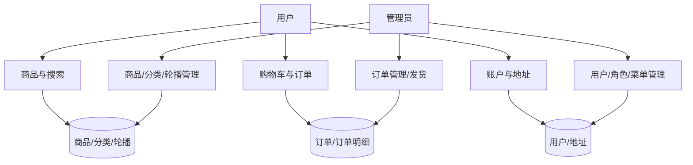
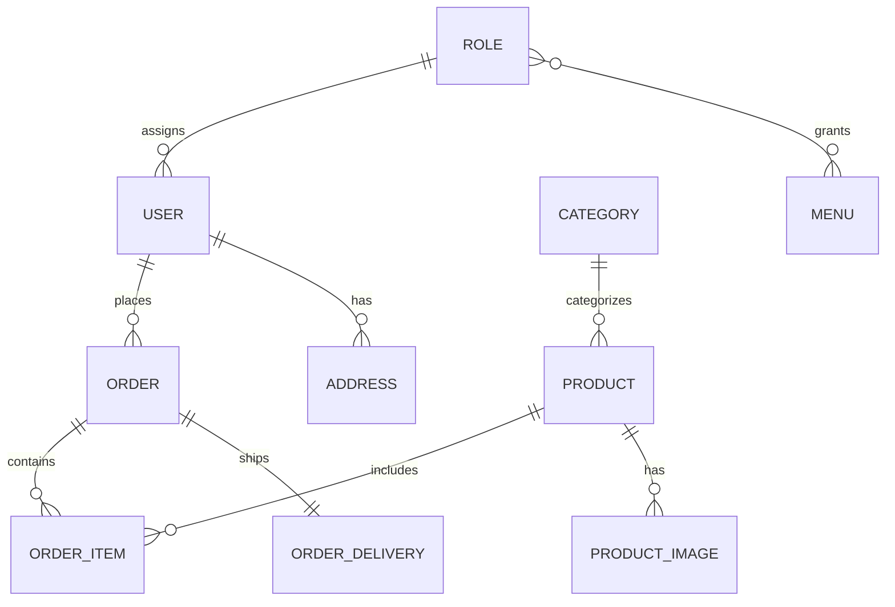
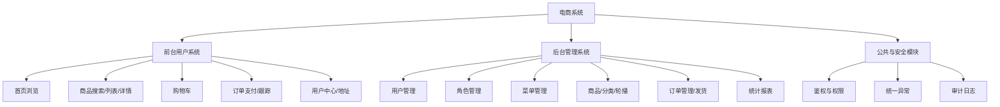
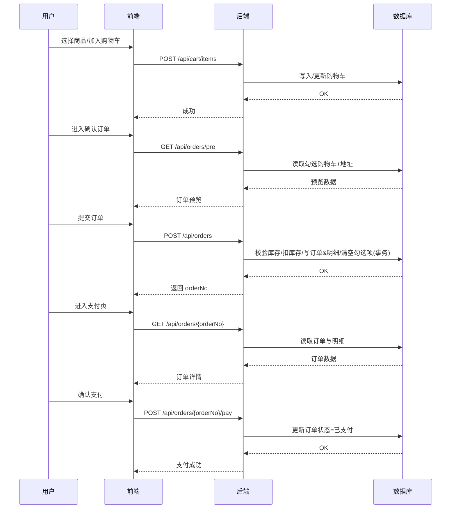
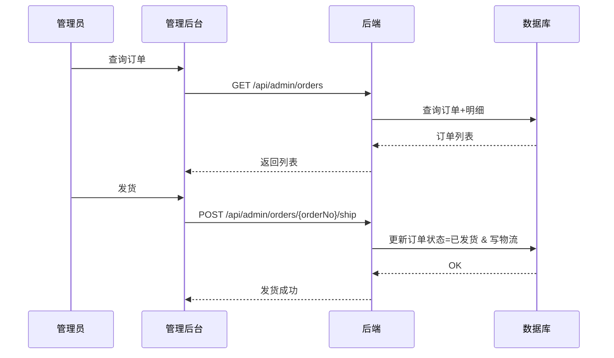

# 系统模型分析（3C电子商城平台）

> 本文档从业务模型、数据模型、功能模型三方面描述系统。

## 1. 业务模型

### 1.1 业务流程
**前台用户流程**
1. 访问首页，浏览轮播图与推荐商品。
2. 通过搜索或分类筛选进入商品列表。
3. 查看商品详情，选择数量加入购物车。
4. 在购物车中勾选商品并进入确认订单。
5. 选择/新增收货地址并创建订单。
6. 进入支付页面完成支付。
7. 在“我的订单”跟踪订单状态，已发货后确认收货。

**后台管理员流程**
1. 管理员登录后台。
2. 管理商品、分类、轮播图等基础数据。
3. 查询订单并对已支付订单发货。
4. 查看统计报表与导出数据。
5. 管理用户、角色、菜单与权限配置（RBAC）。

### 1.2 人机分工
**用户端（人）**
- 发起搜索、选品、下单、支付、确认收货。
- 维护个人信息与收货地址。

**系统端（机）**
- 商品搜索与分页。
- 订单创建与库存扣减（事务）。
- 订单状态流转与通知。
- 权限控制与安全校验。
- 统计与导出。

**管理员端（人）**
- 维护商品、分类、轮播图、菜单与角色。
- 处理订单发货、查看统计报表。

### 1.3 数据流图（DFD）
#### 1.3.1 0层（上下文图）

#### 1.3.2 1层（核心子过程）

## 2. 数据模型

### 2.1 E-R 模型（文字化描述）
- **用户(User)** 与 **订单(Order)**：一对多（一个用户可有多个订单）。
- **订单(Order)** 与 **订单明细(OrderItem)**：一对多。
- **商品(Product)** 与 **订单明细(OrderItem)**：一对多（商品可出现在多个订单明细）。
- **用户(User)** 与 **地址(Address)**：一对多。
- **分类(Category)** 与 **商品(Product)**：一对多。
- **商品(Product)** 与 **商品图片(ProductImage)**：一对多。
- **角色(Role)** 与 **用户(User)**：一对多（一个角色对应多个用户）。
- **角色(Role)** 与 **菜单(Menu)**：多对多（通过 role_menu 关联表）。
- **订单(Order)** 与 **发货信息(OrderDelivery)**：一对一。

#### E-R 图（Mermaid）

### 2.2 数据字典（核心表）
以下字段以 `basic.sql` 为准，仅列核心字段。

**user（用户表）**
- `id`：主键
- `username`：用户名
- `phone`：手机号
- `password_hash`：密码哈希
- `status`：状态
- `role_id`：角色ID
- `created_at`：创建时间

**role（角色表）**
- `id`：主键
- `role_key`：角色标识
- `role_name`：角色名称

**menu（菜单表）**
- `id`：主键
- `parent_id`：父级菜单
- `name`：菜单名称
- `path`：路由路径
- `component`：组件标识
- `type`：菜单类型（MENU/BUTTON）
- `perm_code`：权限编码
- `sort`：排序
- `visible`：是否可见

**role_menu（角色-菜单关联）**
- `id`：主键
- `role_id`：角色ID
- `menu_id`：菜单ID

**category（分类表）**
- `id`：主键
- `name`：分类名称
- `parent_id`：父级分类
- `sort`：排序
- `status`：状态

**product（商品表）**
- `id`：主键
- `category_id`：分类ID
- `name`：商品名
- `brief`：简介
- `price`：价格
- `stock`：库存
- `status`：上/下架
- `cover_url`：封面图
- `detail_html`：详情富文本
- `created_at`：创建时间

**product_image（商品图片）**
- `id`：主键
- `product_id`：商品ID
- `url`：图片地址
- `sort`：排序

**banner（轮播图）**
- `id`：主键
- `image_url`：图片地址
- `link_type`：跳转类型
- `link_target`：跳转目标
- `sort`：排序
- `status`：状态

**cart_item（购物车）**
- `id`：主键
- `user_id`：用户ID
- `product_id`：商品ID
- `quantity`：数量
- `checked`：是否勾选
- `created_at`：创建时间

**address（地址）**
- `id`：主键
- `user_id`：用户ID
- `receiver`：收货人
- `phone`：手机号
- `province/city/area/detail`：地址组成
- `is_default`：默认地址

**order（订单）**
- `id`：主键
- `order_no`：订单号
- `user_id`：用户ID
- `total_amount`：总金额
- `pay_amount`：实付金额
- `status`：订单状态
- `address_snapshot`：地址快照
- `created_at/paid_at/shipped_at/finished_at`：时间字段

**order_item（订单明细）**
- `id`：主键
- `order_id`：订单ID
- `product_id`：商品ID
- `product_name_snapshot`：商品名快照
- `price_snapshot`：价格快照
- `quantity`：数量
- `image_snapshot`：图片快照

**order_delivery（发货信息）**
- `order_id`：订单ID
- `express_no`：物流单号
- `express_company`：物流公司

**merchant_notice（商家通知）**
- `id`：主键
- `notice_type`：类型
- `order_no`：订单号
- `content`：内容
- `status`：阅读状态
- `created_at`：创建时间

## 3. 功能模型

### 3.1 功能结构（顶层）
- 前台用户系统
- 后台管理系统
- 公共与安全模块

### 3.2 模块划分
**前台用户系统**
- 首页浏览模块：轮播图、推荐/热销/促销
- 商品模块：搜索、列表、详情
- 购物车模块：增删改查、勾选
- 订单模块：确认下单、支付、订单跟踪
- 用户中心模块：登录/注册、个人信息、地址管理

**后台管理系统**
- 用户管理：列表、禁用、重置密码
- 角色管理：角色 CRUD、分配菜单
- 菜单管理：菜单/按钮权限维护
- 商品管理：商品 CRUD、上下架
- 分类管理：分类 CRUD、状态管理
- 轮播图管理：轮播 CRUD
- 订单管理：查询、发货、导出
- 统计管理：销售概览与排行

**公共与安全模块**
- 统一响应与异常处理
- 权限校验（RBAC）
- JWT 认证与安全拦截
- 日志与审计

### 3.3 功能结构图（Mermaid）

---

> 以上模型可直接用于论文的系统分析章节，可根据需要补充“业务时序图”“性能需求”“安全需求”等内容。

## 4. 业务时序图

### 4.1 下单与支付时序图

### 4.2 后台发货时序图

## 5. 性能需求（结合实现）

- 首页与详情页秒级响应：首页推荐、商品详情属于高频读取，需使用缓存（Redis）或分页/索引优化确保响应时间稳定。
- 搜索分页性能：商品列表页依赖 `GET /api/products` 分页查询，要求在大数据量情况下保持可用；需索引优化（如商品名、分类、状态）。
- 下单与扣库存原子性：`POST /api/orders` 包含多表写入与库存扣减，要求事务一致性与低延迟。
- 后台列表与导出性能：管理后台订单分页与导出在高数据量下需保证可用（分页、异步导出或导出限制）。

## 6. 安全需求（结合实现）

- 身份认证（JWT）：登录后返回 Token，前端请求携带 Authorization，后端通过 Security 过滤链校验。
- 授权控制（RBAC）：角色—菜单—权限三层结构，后端接口基于权限码拦截，前端动态渲染菜单与按钮。
- 接口防护：登录失败计数、Token 黑名单、401/403 统一拦截。
- 输入与上传安全：富文本内容 XSS 清洗（Jsoup）；上传文件白名单校验。

## 7. 可用性与可靠性需求

- 关键业务可回滚：下单、扣库存、订单明细写入必须在事务内，失败应回滚。
- 统一异常处理：统一错误码与错误信息返回，方便前后端处理与排障。
- 日志与审计：管理后台核心操作（用户、商品、订单）需要审计日志便于追溯。