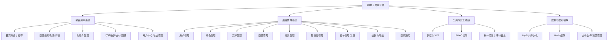

# 系统主要功能模块（论文版）

## 模块结构图（Mermaid）

## 模块需求描述（按指定格式）

（1）接口控制管理  
对各接口业务进程进行统一控制，按权限与角色进行访问拦截，保证前后台访问边界清晰。  
（以下略）

（2）接口日志功能  
提供详细、清晰、规范的日志记录机制，可按业务模块、等级进行分类记录，支持审计与排错。  
（以下略）

（3）认证与权限管理  
通过 JWT 实现无状态认证，结合 RBAC 模型进行菜单与按钮级权限控制，确保后台操作安全可控。  
（以下略）

（4）首页与推荐模块  
提供轮播图、推荐/热销/促销商品展示能力，满足首页导购与活动曝光需求。  
（以下略）

（5）商品与搜索模块  
支持商品列表、分类筛选、关键词搜索与详情展示，保证用户高效发现与浏览商品。  
（以下略）

（6）购物车模块  
支持购物车增删改查、勾选结算、数量调整与价格计算。  
（以下略）

（7）订单与支付模块  
支持下单事务（含库存扣减）、订单支付、订单状态跟踪与确认收货。  
（以下略）

（8）用户中心与地址模块  
支持个人信息维护、密码修改、收货地址 CRUD，并可查看订单与收藏/足迹。  
（以下略）

（9）后台商品与分类管理模块  
支持商品、分类的新增、编辑、上下架控制，以及轮播图管理。  
（以下略）

（10）后台用户与角色管理模块  
支持用户管理、角色管理、菜单权限分配，实现后台系统的组织级管理。  
（以下略）

（11）统计与导出模块  
支持订单统计概览、热销排行与 Excel 导出，满足运营分析需求。  
（以下略）

（12）通知与消息模块  
支持商家通知列表与已读标记，增强后台运营可见性。  
（以下略）

---

**表3.1 商城其它业务功能**

| 功能编号 | 功能名称 | 功能描述 | 优先级 |
| --- | --- | --- | --- |
| 1 | 轮播图管理接口 | 用于首页轮播图新增、编辑、启用、排序 | 高 |
| 2 | 订单导出接口 | 按筛选条件导出订单为 Excel | 高 |
| 3 | 统计概览接口 | 今日订单、总销售额、热销排行 | 中 |
| 4 | 商品图片上传接口 | 上传商品封面与详情图 | 高 |
| 5 | 商家通知接口 | 支付后通知商家，后台读取/已读 | 中 |
| 6 | 订单再购接口 | 将历史订单商品重新加入购物车 | 中 |

**续表3.1 商城其它业务功能**

| 功能编号 | 功能名称 | 功能描述 | 优先级 |
| --- | --- | --- | --- |
| 7 | 地址管理接口 | 地址新增/修改/删除/默认设置 | 高 |
| 8 | 收藏/足迹接口 | 用户收藏与足迹记录查询与清理 | 中 |
| 9 | 账号安全接口 | 修改密码、登录登出、会话失效 | 高 |
