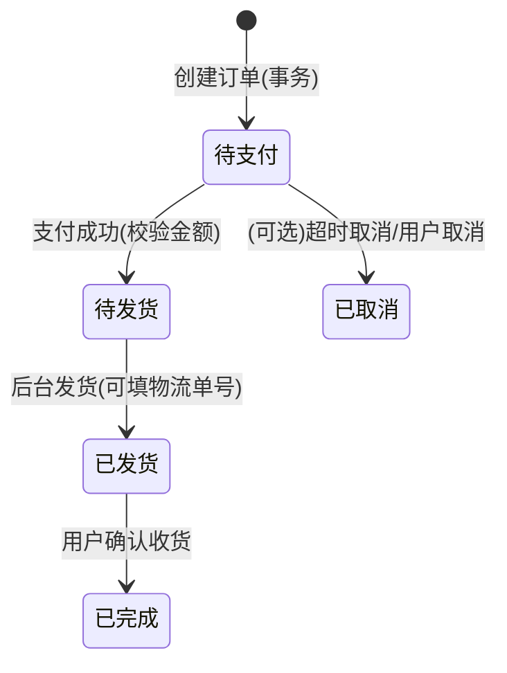

下面我把任务表补充了你要的两列：**状态**、**完成日期**（仍是 Markdown，可直接复制）。

------

## 项目任务表（含状态/完成日期）

> 状态建议填写：未开始 / 进行中 / 已完成 / 阻塞

| 编号 | 模块          | 任务项（要做什么）                                           | 产出/验收标准（怎么证明完成）                                | 依赖     | 优先级 | 状态   | 完成日期 |
| ---- | ------------- | ------------------------------------------------------------ | ------------------------------------------------------------ | -------- | ------ | ------ | -------- |
| 0.1  | 项目准备      | 建仓与基础工程：后端 Spring Boot、前端 Vue（含路由/状态管理/axios） | 两端可启动；前端能请求一个 hello API                         | 无       | P0     | 未开始 |          |
| 0.2  | 项目准备      | 环境与规范：Git 分支规范、统一返回体、全局异常、日志         | 有统一 JSON 返回结构；异常有错误码/提示                      | 0.1      | P0     | 未开始 |          |
| 0.3  | 项目准备      | API 文档：Swagger/OpenAPI（或 Apifox）                       | 访问 /swagger-ui；接口可在线调试                             | 0.1      | P1     | 未开始 |          |
| 1.1  | 数据库        | 核心表设计：user/role/menu/role_menu/product/category/cart/order/order_item/banner | ER 图 + 建表 SQL；字段覆盖业务流程                           | 需求梳理 | P0     | 未开始 |          |
| 1.2  | 数据库        | 地址管理表（address）+ 订单地址快照字段                      | 有 address CRUD；下单时保存地址快照                          | 1.1      | P0     | 未开始 |          |
| 2.1  | 认证与权限    | 登录/注册：密码加密、JWT/Session、登录态维护                 | 注册成功入库；登录返回 token；请求鉴权通过/拦截              | 1.1      | P0     | 未开始 |          |
| 2.2  | 认证与权限    | RBAC：菜单+按钮权限模型、动态路由所需接口                    | 登录后返回 menus/perms；后端可校验权限                       | 2.1、1.1 | P0     | 未开始 |          |
| 2.3  | 认证与权限    | 前端权限：路由守卫 + 按钮权限指令/组件                       | 无权限路由进不去；按钮按 perms 显隐                          | 2.2      | P0     | 未开始 |          |
| 3.1  | 商品（前台）  | 首页接口：轮播图+推荐/热销/促销商品（可先做简版）            | 首页能展示 banner 与商品卡片                                 | 1.1      | P1     | 未开始 |          |
| 3.2  | 商品（前台）  | 分类与搜索：分类树/列表、关键词搜索、分页                    | 分类页/搜索页能分页展示商品                                  | 1.1      | P1     | 未开始 |          |
| 3.3  | 商品（前台）  | 商品详情：多图、参数、库存、加入购物车/立即购买              | 详情页信息完整，按钮可触发后端                               | 3.2、4.1 | P0     | 未开始 |          |
| 4.1  | 购物车        | 购物车 CRUD：加入、数量修改、删除、勾选结算、总价计算        | 购物车页能同步数量/价格/选择状态                             | 2.1、1.1 | P0     | 未开始 |          |
| 5.1  | 订单          | 下单确认页：地址选择、商品清单、金额校验                     | 可选择/新增地址；金额正确                                    | 1.2、4.1 | P0     | 未开始 |          |
| 5.2  | 订单          | 创建订单事务：Order + OrderItem + 扣库存 + 清购物车          | 一次请求生成订单与明细；库存减少；购物车清理                 | 5.1      | P0     | 未开始 |          |
| 5.3  | 订单          | 支付（模拟）：支付页/按钮；更新订单状态                      | 支付后状态从待支付→待发货                                    | 5.2      | P0     | 未开始 |          |
| 5.4  | 订单          | 订单追踪：我的订单列表、按状态筛选、确认收货                 | 状态流转可见；确认收货变已完成                               | 5.3      | P1     | 未开始 |          |
| 5.5  | 订单          | “发送订单信息给商家”落地（简版/加分版二选一）                | 简版：后台待发货列表即“收到订单”；加分：邮件/站内消息/WebSocket | 5.3      | P1     | 未开始 |          |
| 6.1  | 后台-用户     | 用户管理：列表/新增/编辑/禁用/重置密码                       | 后台可操作用户并生效                                         | 2.2、1.1 | P1     | 未开始 |          |
| 6.2  | 后台-菜单     | 菜单管理：树形菜单 CRUD、按钮权限点维护                      | 菜单树可增删改；权限点可配置                                 | 2.2、1.1 | P0     | 未开始 |          |
| 6.3  | 后台-商品     | 商品管理：商品 CRUD、上下架、分类绑定                        | 商品列表可筛选；上下架影响前台展示                           | 1.1      | P0     | 未开始 |          |
| 6.4  | 后台-文件     | 图片上传：商品图/轮播图上传、存储、静态访问                  | 上传成功返回 URL；前端可展示；限制类型/大小                  | 6.3      | P0     | 未开始 |          |
| 6.5  | 后台-订单     | 订单管理：订单筛选、查看明细、发货、录物流单号（可选）       | 状态从待发货→已发货；可查订单项                              | 5.3      | P0     | 未开始 |          |
| 6.6  | 后台-统计导出 | 统计报表（今日订单数/销售额/Top10）+ Excel 导出              | 后台可看报表；导出下载 Excel                                 | 6.5      | P1     | 未开始 |          |
| 7.1  | 缓存与性能    | Redis 缓存：商品详情/首页推荐 cache-aside + 失效策略         | 热点接口响应更快；更新商品时缓存失效                         | 3.1/3.3  | P2     | 未开始 |          |
| 7.2  | 安全加固      | 安全：密码 BCrypt、上传白名单、富文本 XSS 处理、关键操作二次确认 | 安全点可演示（非法上传/未授权访问被拦截）                    | 2.x、6.4 | P1     | 未开始 |          |
| 8.1  | 测试          | Postman Collection：覆盖核心接口（登录/商品/购物车/订单/后台） | 一键跑通；含环境变量 token/baseUrl                           | 2~6      | P1     | 未开始 |          |
| 8.2  | 测试          | 端到端场景测试：浏览→加购→下单→支付→后台发货                 | 录屏/截图+测试用例文档                                       | 8.1      | P1     | 未开始 |          |
| 9.1  | 部署交付      | Docker Compose：mysql + redis + backend + frontend + nginx（可选） | 一条命令启动；README 写清楚                                  | 0~8      | P2     | 未开始 |          |
| 9.2  | 文档交付      | 项目文档：需求、架构、数据库、接口、部署、演示账号           | 文档齐全可复现；答辩材料可直接用                             | 9.1      | P0     | 未开始 |          |


下面我从**软件工程**（需求→架构→详细设计→实现→测试→交付）的角度，把你前面任务表再进一步“工程化细化”：每一块不仅写“做什么”，还写清楚**边界、接口契约、数据模型、关键技术点、可验收点**，方便你按模块落地实现与写文档。

------

## 1. 需求分解（从“功能点”到“可交付需求”）

你的项目核心主线是：**前台闭环（浏览/搜索→详情→加购→下单→支付→追踪） + 后台（用户/菜单RBAC/商品/轮播图/订单统计导出）**。
文档明确列出：登录与权限验证、后台用户/菜单/商品/订单管理，前台用户中心、首页/分类/搜索、购物车、订单支付与追踪，并要求“支付后发送订单信息给商家”。

从软件工程角度，建议把需求拆为 3 层：

### A. 业务需求（BR）

- BR1：用户可完成“浏览→购买→支付→查看订单状态”的完整购物链路。
- BR2：管理员可维护商品与营销资源（商品图、轮播图）、并处理订单发货与统计导出。
- BR3：系统必须实现 RBAC（菜单+按钮权限、动态路由），保证后台安全可控。

### B. 系统需求（SR）

- SR1：前后端分离，RESTful API；分层：Controller/Service/DAO。
- SR2：订单创建必须事务一致性（生成订单+订单项+扣库存+清购物车）。
- SR3：性能与安全：Redis热点缓存、密码保密处理、关键操作二次确认、HTTPS。
- SR4：测试与交付：Postman 接口测试 + 端到端集成测试；Docker 容器化。

### C. 易漏的“验收型需求”（必须补齐，不然链路会断）

- 地址管理 + 订单地址快照（订单确认页必须能选地址）。
- “商家收到订单”的落地（至少后台待发货列表；加分可通知）。
- 图片上传/静态资源访问 + 富文本 XSS 处理。
- RBAC落地到按钮权限与动态路由（menus/perms）。

------

## 2. 架构与模块设计（工程视角的“可实现”方案）

### 2.1 分层与模块边界

你的架构文档建议采用：表现层（Vue）→控制层（Controller）→业务层（Service）→持久层（DAO/MyBatis）。
落到代码工程中，建议按“业务域”拆包（更好维护、也方便论文写模块化）：

- `auth`（认证与授权：登录、JWT、RBAC）
- `user`（用户信息、地址、个人中心）
- `product`（分类、商品、轮播图、搜索）
- `cart`（购物车）
- `order`（订单交易、库存扣减、支付模拟、状态流转）
- `admin`（后台管理：用户/菜单/商品/订单/统计/导出）
- `common`（统一返回体、异常、工具、常量、日志审计）

（文档也提到模块化划分：认证中心/商品服务/订单交易/后台管理中心）。

### 2.2 核心数据实体（建议的最小表集）

结合需求对照对 RBAC/地址/日志等要求，建议至少这些表（便于你写 ER 图与实现）：

- 权限：`user` `role` `menu` `role_menu`（menu含 MENU/BUTTON、perm_code）
- 商品：`category` `product`（含 detail_html）`product_image`（多图）`banner`
- 交易：`cart` `order` `order_item`（订单项存商品快照）
- 地址：`address`（默认地址字段） + `order` 中保存地址快照字段
- 审计（加分且实用）：`operation_log`（记录admin上下架/删除/发货等）

### 2.3 关键业务流程的“工程化落点”

- 搜索：后端 `LIKE %keyword%`，前端分页展示。
- 购物车：加购需校验登录+库存；同商品存在则数量+1；支持勾选结算与总价同步。
- 订单创建：事务包含库存校验→主订单→订单项快照→扣库存→清购物车。
- 支付模拟：支付页按钮/二维码展示；后端校验金额；支付成功更新状态为“已支付/待发货”。
- 后台订单：按时间/订单号/用户筛选；发货更新状态；统计聚合 Count/Sum；导出用 Apache POI。

------

## 3. 技术实现细化（按模块给到“怎么做”）

下面每一块都按：**接口/核心逻辑/关键技术点/验收** 来写，你可以直接抄进“详细设计/实现方案”章节。

### 3.1 认证与 RBAC（菜单+按钮+动态路由）

文档指出：后端可用 Spring Security 或拦截器实现 JWT 认证鉴权；登录返回角色信息。
需求对照强调：登录后返回 `menus` 做动态路由、`perms` 做按钮级控制。

**接口建议**

- `POST /api/auth/register`
- `POST /api/auth/login` → 返回 `{token, userInfo, menus, perms}`
- `GET /api/auth/me`（可选）

**关键实现点**

- 密码：BCrypt 存储（文档允许 MD5/BCrypt，但工程上建议 BCrypt）。
- 鉴权：
  - A方案：Spring Security + JWT Filter + 方法级 `@PreAuthorize("hasAuthority('perm')")`（更易展示按钮权限）。
  - B方案：拦截器 + JWT 解析 + 自定义注解/切面做权限校验（实现成本略高一些）
- 动态路由：`menus` 返回树（按 parentId/build tree），前端登录后注入路由；按钮权限用 `v-permission` 指令。

**验收**

- 无 token 访问后台接口返回 401；无权限返回 403。
- 同账号不同角色登录，看到的菜单与按钮不同。

------

### 3.2 商品域（首页/分类/搜索/详情/图片/富文本）

架构文档明确：详情页需返回基础信息、价格、库存、多图、规格参数。
后台商品管理包含：图片上传、富文本详情 HTML、轮播图管理。

**接口建议**

- `GET /api/banners`
- `GET /api/categories/tree`
- `GET /api/products?keyword=&categoryId=&page=&size=`
- `GET /api/products/{id}`（含 images、params、detailHtml）
- 后台：`POST/PUT/DELETE /api/admin/products`、`POST /api/admin/upload`、`POST/PUT/DELETE /api/admin/banners`

**关键实现点**

- 搜索 SQL：`name LIKE %keyword%` + 分类过滤 + 分页。
- 多图：建议 `product_image(product_id,url,sort)`，详情返回按 sort 排序。
- 富文本安全：入库前做白名单过滤/去脚本（XSS），需求对照明确这是必做安全点。
- 图片上传：限制类型/大小、重命名、防路径穿越；URL 存库；静态资源可用 Nginx 或 Spring 静态映射。

**验收**

- 前台首页并行拉 banner + 推荐商品渲染（文档流程要求）。
- 后台新增商品：上传图→拿到 URL→提交商品→前台可见。

------

### 3.3 购物车域（状态同步与结算）

文档给了非常明确的购物车流程：加购校验登录/库存；存在则数量+1；修改数量/删除；勾选计算总价。

**接口建议**

- `POST /api/cart/items`（productId, qty）
- `GET /api/cart`（返回商品名、图、单价、数量、小计、checked）
- `PUT /api/cart/items/{itemId}`（qty/checked）
- `DELETE /api/cart/items/{itemId}`

**关键实现点**

- 购物车表建议唯一约束：`(user_id, product_id)`，便于“存在则+1”。
- 金额计算：后端返回时计算小计/总价，避免前端自算不一致（也便于支付校验）。
- 防越权：所有 cart 操作必须按当前 user_id 过滤（绝不能通过 itemId 直接改他人）。

**验收**

- 同一商品加购两次，购物车只一条记录，数量累加。
- 勾选/取消勾选，总价实时变化。

------

### 3.4 订单域（事务一致性 + 状态机 + 幂等/防超卖）

订单流程是“核心复杂逻辑”，文档已明确：确认页选地址→提交订单事务→支付校验金额→状态追踪。

**接口建议**

- `GET /api/orders/pre`（从购物车勾选项生成确认页数据：商品清单、总价、可选地址）
- `POST /api/orders`（创建订单：addressId / cartItemIds / payAmount）
- `POST /api/orders/{orderNo}/pay`（模拟支付）
- `GET /api/orders`（我的订单+状态筛选）
- `POST /api/orders/{orderNo}/confirm`（确认收货）

**关键实现点（最重要）**

1. **订单创建事务**（必须 `@Transactional`）
   - 校验库存充足 → 写 `order` → 写 `order_item`（商品快照） → 扣库存 → 清购物车。
2. **库存扣减防超卖**（建议用“条件更新”）
   - `UPDATE product SET stock = stock - ? WHERE id=? AND stock >= ?`
   - 返回行数=0 说明库存不足，事务回滚（需求对照也强调“库存扣减避免超卖 + 事务保证”）。
3. **下单幂等**（防重复点击创建多个订单）
   - 方案1：`order_no` 唯一 + 前端禁用按钮（最低成本）
   - 方案2：幂等 token（pre-order 时发 token，create 时校验一次）
4. **地址快照**
   - order 表保存收件人/电话/详细地址快照，避免用户改地址影响历史订单。
5. **订单状态机**（文档枚举）
   - 0待支付 → 1待发货 → 2已发货 → 3已完成。
   - 后台发货只能从“待发货”变“已发货”；用户确认收货只能从“已发货”变“已完成”。

**“商家收到订单”落地**

- 最低可交付：后台“待发货订单列表”即代表商家收到订单。
- 加分：邮件/站内消息/WebSocket 推送管理员。

**验收**

- 用同一批购物车勾选项重复提交，不会生成多笔订单（幂等验证）。
- 库存不足时下单失败且不会生成半成品订单（事务一致性验证）。
- 支付后状态变“待发货”，后台可见并可发货。

------

### 3.5 后台管理（用户/菜单/商品/订单/统计导出）

文档明确后台功能与流程，含订单统计与导出。

**接口建议**

- 用户：`GET/POST/PUT /api/admin/users`、`PUT /api/admin/users/{id}/disable`
- 菜单：`GET/POST/PUT/DELETE /api/admin/menus`（树形返回）
- 订单：`GET /api/admin/orders?timeRange=&orderNo=&userId=&status=`
- 发货：`POST /api/admin/orders/{orderNo}/ship`（可带物流单号）
- 统计：`GET /api/admin/stats/today`、`GET /api/admin/stats/top-products`
- 导出：`GET /api/admin/orders/export?timeRange=...`

**关键实现点**

- RBAC：后台接口必须校验权限点（至少菜单/按钮级）。
- 统计：聚合查询 Count/Sum；前端 ECharts 绘图（文档建议）。
- 导出 Excel：Apache POI；建议限制时间范围或异步生成，避免大数据量阻塞（需求对照提示）。

**验收**

- 管理员按时间段筛选订单，导出可下载 Excel。

------

## 4. 横切工程能力（文档要求但常被忽略）

### 4.1 统一返回体 + 全局异常 + 错误码

需求对照明确这是“最小工程化清单”，能显著提升整体质量与复用性。

建议：

- 返回体：`{code, message, data, timestamp}`
- 全局异常：参数校验、业务异常（库存不足/无权限/状态非法）、系统异常
- 错误码：按模块分段（AUTH_、ORDER_、PRODUCT_…）

### 4.2 性能与安全（必须可验收）

开题报告明确要做 Redis 缓存热点商品、密码保密处理、关键操作二次确认、HTTPS。
需求对照给了可验收点：BCrypt、登录失败次数限制（Redis计数）、缓存与失效、TLS终止。

建议最小落地：

- Redis：商品详情/首页推荐 Cache-Aside（读缓存→读库→回填；更新商品时删缓存）。
- 登录失败限制：`key=login_fail:{username}` 计数，超过阈值临时封禁
- HTTPS：Docker + Nginx 终止 TLS（演示可用自签证书）
- 前端二次确认：支付/删除/发货等关键操作弹窗确认 + 后端权限校验。

### 4.3 测试与交付（让项目“可复现、可验收”）

开题报告要求 Postman 接口测试 + 端到端场景测试。
需求对照建议：Postman Collection + Newman 一键跑。

交付建议：

- `postman/collection.json` + `environment.json`
- 冒烟脚本：登录→查商品→加购→下单→支付→后台发货
- Docker Compose：mysql、redis、backend、frontend、nginx（需求对照建议一步到位）。

------

## 5. 你可以直接写进论文/文档的“实现要点清单”（浓缩版）

- 前后端分离 + RESTful API + 分层架构（Vue/Controller/Service/DAO）。
- JWT 登录态 + RBAC（菜单/按钮权限、动态路由）。
- 购物车加购校验库存与状态同步。
- 订单创建事务：订单+订单项快照+扣库存+清购物车；支付校验金额；状态追踪。
- 图片上传与富文本 XSS 安全处理；静态资源访问。
- 统计报表 Count/Sum + Excel 导出（POI）。
- Redis 热点缓存 + HTTPS + Postman/Newman + Docker Compose。


下面我按“软件工程可落地交付”的深度，把系统进一步细化到：**接口清单（路径/方法/请求/响应/错误码）+ 数据库表结构（字段/索引/约束）+ 状态流转图（状态机）+ 关键实现要点（事务/幂等/防超卖/安全）**。内容严格对齐你文档里描述的业务流程与补漏要求：购物车→确认页选地址→事务下单→模拟支付→状态追踪，以及后台订单统计导出、RBAC 动态路由/按钮权限等。

------

## 1) 全局接口规范（建议写进《接口文档/详细设计》）

### 1.1 统一返回体（工程化必备）

- 响应结构：`{ code, message, data, timestamp }`（便于前端统一 toast、后端统一异常）
- 鉴权：登录成功返回 JWT，前端存 localStorage，请求 Header 携带 Token。

### 1.2 错误码建议（可直接落表到文档）

| HTTP | code                   | 场景              |
| ---- | ---------------------- | ----------------- |
| 400  | `VALIDATION_ERROR`     | 参数校验失败      |
| 401  | `UNAUTHORIZED`         | 未登录/Token 失效 |
| 403  | `FORBIDDEN`            | 无权限（RBAC）    |
| 404  | `NOT_FOUND`            | 资源不存在        |
| 409  | `CONFLICT`             | 幂等冲突/重复提交 |
| 422  | `OUT_OF_STOCK`         | 库存不足          |
| 422  | `ORDER_STATUS_INVALID` | 非法状态流转      |
| 500  | `INTERNAL_ERROR`       | 未处理异常        |

> 你的需求对照明确建议“统一返回体 + 全局异常 + 错误码”。

------

## 2) API 清单（按业务域拆分，覆盖你文档要求的全链路）

> 下面接口与文档业务流程一一对应：
>
> - 首页并行请求轮播图/推荐商品
> - 详情返回价格/库存/多图/参数
> - 购物车：存在则数量+1、勾选同步总价
> - 下单：确认页选地址→事务创建订单/订单项快照/扣库存/清购物车
> - 支付：校验金额→状态变待发货
> - 后台：订单筛选、发货、统计、POI 导出

### 2.1 Auth（注册/登录/RBAC信息）

**POST** `/api/auth/register`
请求：

```json
{ "username":"", "password":"", "phone":"" }
```

响应：`data=true`

**POST** `/api/auth/login`
响应建议（支持动态路由/按钮权限）：

```json
{
  "token":"jwt...",
  "userInfo": { "id":1, "nickname":"", "role":"ADMIN" },
  "menus":[ /* 树形菜单，用于动态路由 */ ],
  "perms":[ "product:add", "order:export" /* 按钮权限 */ ]
}
```

> 动态路由与按钮权限是补漏重点：登录返回 `menus` + `perms`，前端路由守卫注入路由、按钮用 v-permission 控制。

------

### 2.2 商品与首页（轮播图/推荐/分类/搜索/详情）

**GET** `/api/banners`
返回：banner 列表（含图片 url、跳转类型/商品 id、排序）

**GET** `/api/categories/tree`

**GET** `/api/products`
Query：`keyword`、`categoryId`、`page`、`size`
实现：后端 `LIKE %keyword%` + 分页。

**GET** `/api/products/{id}`
返回需包含：基础信息、价格、库存、多图、规格参数。

------

### 2.3 购物车（加购/改数量/删除/勾选）

**POST** `/api/cart/items`
请求：`{ "productId": 1, "qty": 1 }`
逻辑：校验登录→检查库存→若已存在则数量+1，否则新增记录。

**GET** `/api/cart`
返回：购物车明细（含商品图、名、单价、数量、小计、checked）

**PUT** `/api/cart/items/{itemId}`
请求：`{ "qty": 2, "checked": true }`
逻辑：更新数量并重新计算小计；勾选同步总价。

**DELETE** `/api/cart/items/{itemId}`

------

### 2.4 地址（补漏项：订单确认必须可选地址）

**GET** `/api/addresses`
**POST** `/api/addresses`
**PUT** `/api/addresses/{id}`
**DELETE** `/api/addresses/{id}`
**PUT** `/api/addresses/{id}/default`

> 订单确认页需要“选择收货地址”，因此必须有地址表与 CRUD 接口，并在下单时保存“地址快照”。

------

### 2.5 订单（确认页→创建订单事务→支付→状态追踪）

**GET** `/api/orders/pre`
用途：确认页数据（勾选的购物车项、总金额、地址列表/默认地址）

**POST** `/api/orders`
请求：

```json
{ "addressId": 10, "cartItemIds":[1,2], "payAmount": 3999.00 }
```

后端事务必须包含：校验库存→创建 Order→创建 OrderItem（商品快照）→扣库存→清购物车。
返回：`{ "orderNo":"20260214xxxx" }`

**POST** `/api/orders/{orderNo}/pay`（模拟支付）

- 校验金额，成功后更新状态为“已支付/待发货”。

**GET** `/api/orders`（我的订单/按状态筛选）

- 状态枚举：0待支付、1待发货、2已发货、3已完成。

**POST** `/api/orders/{orderNo}/confirm`（确认收货）

> “支付完成后生成订单、发送订单信息给商家”：最小落地是后台“待发货订单”列表即代表商家收到订单；加分可做邮件/站内消息/WebSocket。

------

### 2.6 后台管理（用户/菜单RBAC/商品/订单/统计/导出）

#### 用户管理

- **GET** `/api/admin/users`（分页）
- **PUT** `/api/admin/users/{id}/disable`（禁用，`status=0`）
- **PUT** `/api/admin/users/{id}/reset-password`

#### 菜单管理（RBAC）

- **GET** `/api/admin/menus/tree`
- **POST/PUT/DELETE** `/api/admin/menus`
- 菜单含“按钮权限”，登录时按角色返回菜单列表做动态路由。

#### 商品管理 + 上传 + 轮播图

- **GET** `/api/admin/products`
- **POST/PUT/DELETE** `/api/admin/products`
- **POST** `/api/admin/upload`（图片上传：保存 OSS/本地→返回 URL→URL 入库）
- **POST/PUT/DELETE** `/api/admin/banners`

> 上传必须做类型/大小白名单、路径隔离、重名处理；富文本 HTML 做 XSS 过滤/白名单。

#### 订单管理/统计/导出

- **GET** `/api/admin/orders`（按时间段、订单号、用户筛选）
- **POST** `/api/admin/orders/{orderNo}/ship`（发货：录物流单号可选→状态变已发货）
- **GET** `/api/admin/stats/today`（Count/Sum：今日订单数、总销售额）
- **GET** `/api/admin/stats/top-products`（热销 Top10）
- **GET** `/api/admin/orders/export`（POI 生成 Excel 下载）

> 导出 Excel 建议“限制时间范围/异步生成”，避免大数据量卡死。

------

## 3) 数据库表结构建议（字段 + 关键索引/约束）

> 文档提到：MySQL 存储用户、商品、订单、系统日志等关键业务数据，并采用 RBAC。

### 3.1 用户与权限（RBAC 必备）

**user**

- `id` PK
- `username` UNIQUE
- `password_hash`
- `phone` UNIQUE
- `nickname`
- `status`（1正常/0禁用）
- `created_at` `updated_at`

**role**

- `id` PK, `name`(ADMIN/USER), `code` UNIQUE

**menu**

- `id` PK
- `parent_id`
- `type` ENUM('MENU','BUTTON')（按钮权限）
- `title` `path` `component` `icon`
- `perm_code`（如 `order:export`）
- `sort` `visible`

**role_menu**

- `role_id` + `menu_id` UNIQUE（联合唯一）

> 需求对照明确 role/menu/role_menu，并强调 menu 含按钮权限与 perm_code。

------

### 3.2 商品域

**category**

- `id` PK, `parent_id`, `name`, `sort`, `status`

**product**

- `id` PK
- `category_id` INDEX
- `name` `sub_title`
- `price` DECIMAL(10,2)
- `stock` INT（库存）
- `status`（上架/下架）
- `detail_html`（富文本，需 XSS 过滤）
- `created_at` `updated_at`

**product_image**

- `id` PK
- `product_id` INDEX
- `url`
- `sort`

**banner**

- `id` PK
- `image_url`
- `jump_type`（PRODUCT/LINK）
- `jump_target`（productId 或 URL）
- `sort` `status`

------

### 3.3 购物车

**cart**

- `id` PK
- `user_id` INDEX
- `product_id` INDEX
- `qty`
- `checked` TINYINT
- UNIQUE(`user_id`,`product_id`) ← 支持“存在则数量+1”

------

### 3.4 地址（补漏必做）

**address**

- `id` PK
- `user_id` INDEX
- `receiver_name` `receiver_phone`
- `province` `city` `district` `detail`
- `is_default` TINYINT
- `created_at` `updated_at`

> 订单确认页要选地址；并且下单要保存地址快照。

------

### 3.5 订单（主表 + 订单项快照）

**order**

- `id` PK
- `order_no` UNIQUE（幂等/防重复下单基础）
- `user_id` INDEX
- `status`（0待支付/1待发货/2已发货/3已完成）
- `total_amount` `pay_amount`
- 地址快照字段：`recv_name` `recv_phone` `recv_full_address`（不要只存 address_id）
- `pay_time` `ship_time` `finish_time`
- `created_at` `updated_at`

**order_item**

- `id` PK
- `order_id` INDEX / `order_no` INDEX（二选一，推荐 order_id）
- `product_id`
- 商品快照：`product_name` `product_image` `unit_price` `qty` `subtotal`
- `created_at`

**operation_log**（加分：后台审计）

- `id` PK, `admin_id`, `action`, `target_type`, `target_id`, `detail`, `created_at`

------

## 4) 状态机（订单状态流转图，可直接贴到文档）



- 状态枚举与追踪要求：0待支付、1待发货、2已发货、3已完成。
- 支付后状态更新为“已支付/待发货”。

------

## 5) 关键技术实现要点（软件工程“风险点→对策”）

### 5.1 订单创建必须事务（避免半成品数据）

下单流程必须“后端事务开启”，包含：库存校验→写主订单→写订单项快照→扣库存→清购物车。
**实现建议**：`@Transactional(rollbackFor=Exception.class)` + 业务异常抛出即回滚。

### 5.2 防超卖（库存扣减）

建议用“条件更新”扣库存：`stock >= qty` 才允许扣减；失败则抛 `OUT_OF_STOCK` 回滚。
需求对照已明确“库存扣减避免超卖：SQL条件更新 + 事务保证”。

### 5.3 幂等（防重复下单）

同一购物车/重复点击会重复创建订单：

- 最小方案：`order_no` UNIQUE + 前端按钮防抖
- 加强方案：确认页发“幂等 token”，创建订单时一次性校验
  需求对照明确“订单创建必须做幂等”。

### 5.4 上传与富文本安全

后台商品新增/编辑包含：图片上传、富文本 HTML。
必须补齐：上传白名单/大小限制/路径隔离/重名处理；富文本 XSS 过滤。

### 5.5 RBAC 落地到“动态路由 + 按钮权限”

- 菜单管理包含“新增菜单/按钮权限”；登录按角色返回菜单列表，前端动态生成侧边栏。
- 必须实现 `menus + perms`，前端路由守卫 + v-permission。

### 5.6 导出 Excel 的工程化处理

后台有“导出订单状态信息”，实现方式：Apache POI 生成 Excel。
建议：限制时间范围/异步生成，避免卡死。

------

如果你愿意，我可以继续把上面每个接口再补充成**“接口契约表”（字段类型/必填/示例/错误码）**，并把这些内容按论文常见结构整理成：**《概要设计》+《详细设计》+《数据库设计》+《接口设计》+《测试用例》** 五个章节的可直接粘贴版。